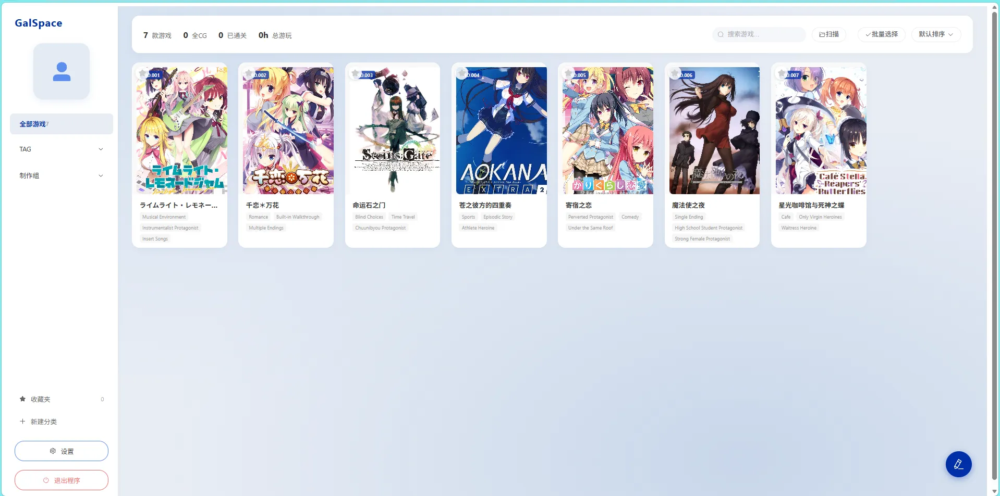

# GalSpace 项目文档

🎮 **Galgame 游戏管理工具** — 基于 Spring Boot + Vue 3 的本地游戏库管理应用，集成 VNDB 信息抓取、AI 翻译、分类管理等强大功能。

---

项目地址：[anyayuqiu/GalSpace: 🎮 Galgame 及 视觉小说 游戏管理工具 — 基于 Spring Boot + Vue 3 的本地游戏库管理应用，集成 VNDB 信息抓取、AI 翻译、分类管理等强大功能。](https://github.com/anyayuqiu/GalSpace)

---

## ✨ 功能特点

### 🎮 游戏库管理

* **本地扫描导入** — 自动扫描目录中的 exe 文件，模糊匹配导入
* **手动添加** — 填写游戏名称、启动程序、目录即可添加
* **拖拽排序** — 卡片自由拖拽调整展示顺序，自动持久化
* **批量操作** — 多选后批量删除、添加到分类、VNDB 抓取
* **编辑与删除** — 修改名称、路径、封面模糊等设置



### 🔍 VNDB 集成

* **信息抓取** — 自动从 VNDB 获取游戏标题、描述、评分、截图、平台、语言等
* **封面与截图** — VNDB CDN 直接加载，无需本地下载
* **批量导入** — 多选游戏一键批量 VNDB 搜索 + 导入，6 线程并行加速
* **导入结果** — 完成后自动弹窗显示成功/失败统计


### 🌐 AI 翻译

* **DeepSeek 集成** — 自动翻译游戏简介和标签为简体中文
* **API Key 配置** — 在设置中配置自己的 DeepSeek API Key
* **智能过滤** — 翻译前自动清理 `[xxx]` 标记内容


### 🏷️ 标签与分类

* **TAG 系统** — 侧边栏 TAG 菜单展示翻译后的中文标签，点击筛选
* **自定义分类** — 创建自定义分类（可选颜色），游戏关联/取消关联
* **收藏夹** — 点击封面星标收藏，底部菜单快速筛选
* **删除分类** — hover 显示删除图标，确认后联级清理关联

### 🖥️ 详情展示

* **85vw 宽屏详情弹窗** — 大封面 + 横向信息布局
* **丰富元信息** — 厂商、发售日、时长、投票数、平台、语言、原语
* **分类 Chip** — 点击 chip 标签直接切换游戏分类

### ⚙️ 网络与部署

* **局域网访问** — `server.address=0.0.0.0` 后局域网设备均可访问
* **端口自定义** — 支持 1024-65535 范围任意端口
* **保存并重启** — 修改网络配置后一键重启生效
* **自带 JRE** — 可携带精简 JRE 免安装 Java 双击即用

### 🖼️ 图片管理

* **封面模糊** — 全局或单游戏封面模糊开关
* **游戏截图** — 详情页横向滚动展示 VNDB 截图
* **默认封面** — 未获取封面时显示默认占位图

***

## 🛠 技术栈

| **层级**   | **技术**                                                 |
| -------- | ------------------------------------------------------ |
| **前端**   | Vue 3 + TypeScript + Element Plus + Vite               |
| **后端**   | Spring Boot 3.2 + Java 17 + Maven                      |
| **数据**   | JSON 文件存储 (games.json / categories.json / config.json) |
| **API**  | VNDB REST API v2                                       |
| **AI**   | DeepSeek Chat Completions API                          |
| **运行环境** | Windows / 可打包 JRE 免安装                                  |

***

## 📦 快速开始

### 环境要求

* Java 17+
* Node.js 18+ (仅开发)

### 1. 克隆仓库

```bash
git clone https://github.com/your-username/GalSpace.git
cd GalSpace
```

### 2. 构建前端

```bash
cd frontend
npm install
npx vite build
```

### 3. 构建后端

```bash
cd ..
mvn clean package -DskipTests
```

### 4. 启动

```bash
# Windows 直接双击
start.bat

# 或命令行启动
java -jar target/GalSpace-1.0.0-SNAPSHOT.jar
```

浏览器自动打开 `http://localhost:8080`

### 开发模式

```bash
# 终端1: 启动后端 (默认8080端口)
mvn spring-boot:run

# 终端2: 启动前端开发服务器 (3000端口，自动代理API)
cd frontend
npm run dev
```

***

## 🚀 打包发布

```bash
# 1. 构建前端
cd frontend && npx vite build && cd ..

# 2. 构建 JAR
mvn clean package -DskipTests

# 3. 生成精简 JRE (可选，约45MB)
powershell -ExecutionPolicy Bypass -File make-jre.ps1

# 4. 整理发布目录
mkdir release
copy target\GalSpace-1.0.0-SNAPSHOT.jar release\
copy start.bat release\
xcopy /E /I jre release\jre\
```

发布包结构：
