# GalSpace2 项目文档

GalSpace2 是一款面向 Windows 的本地 Galgame 游戏库管理工具。它用卡片展示游戏，支持从本地目录导入、检索 VNDB 信息、管理封面和截图、启动游戏，并在同一界面整理标签、简介、游玩时长和存档路径。当前应用窗口与构建产物的名称为 **GalManager**。

> 项目以管理已有的本地游戏为主。导入游戏会记录其所在目录；软件不会自动下载游戏本体。
>
> github开源地址：[anyayuqiu/GalSpace2](https://github.com/anyayuqiu/GalSpace2)

**Windows 版下载**：[下载 GalManager 1.0.0 压缩包（约 83 MB）](/uploadresources/GalManager%201.0.0.exe.zip)

## 功能特色

### 游戏库与信息整理

* **多种导入方式**：可选择单个目录、批量选择目录，或扫描本地目录后挑选游戏导入。

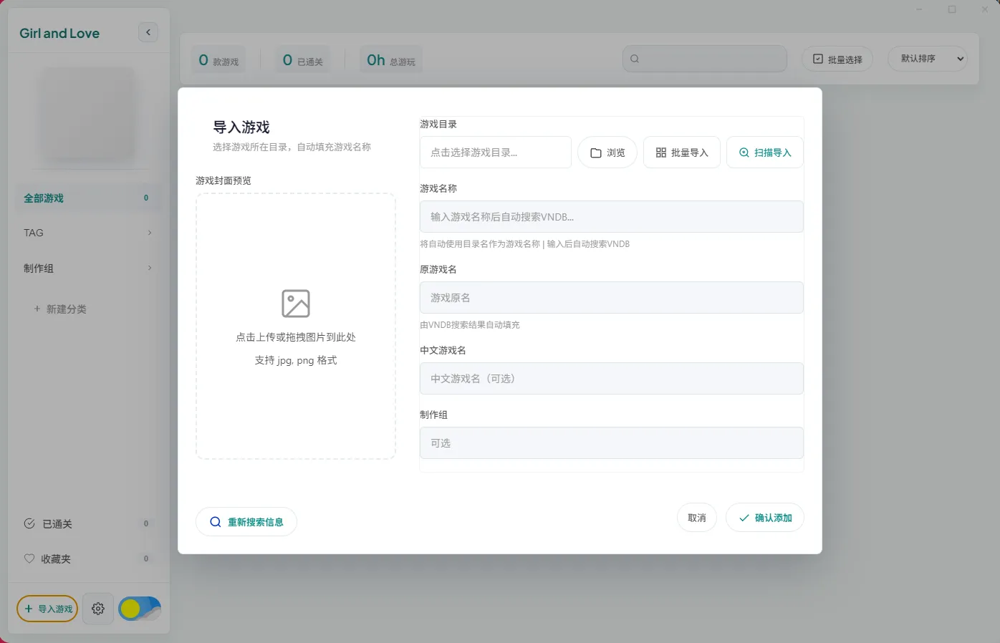

（导入选项）

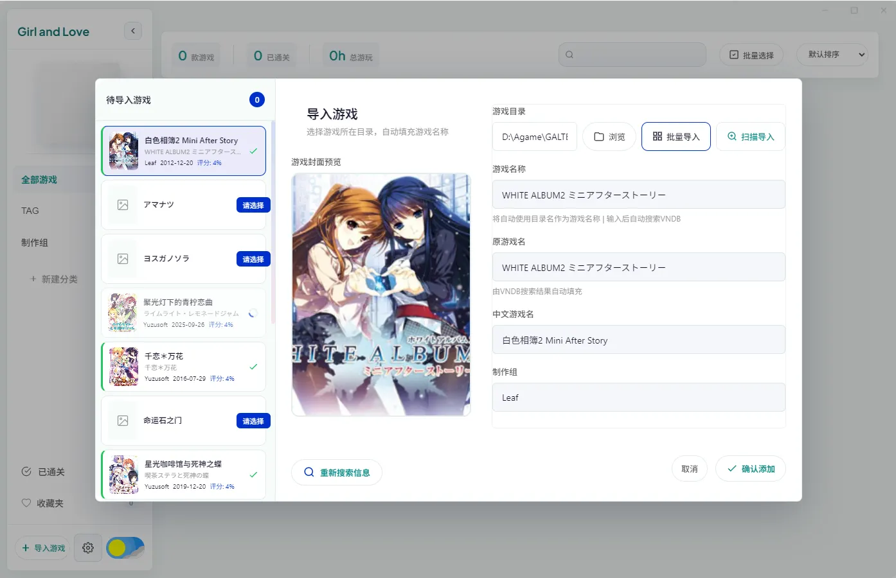

（导入页面）

* **VNDB 信息检索**：按游戏名称查询候选条目，补充原名、中文名、制作方、发行信息、简介、评分、标签、封面和截图等可用资料。重新搜索信息时，可从多个结果中选择并确认。

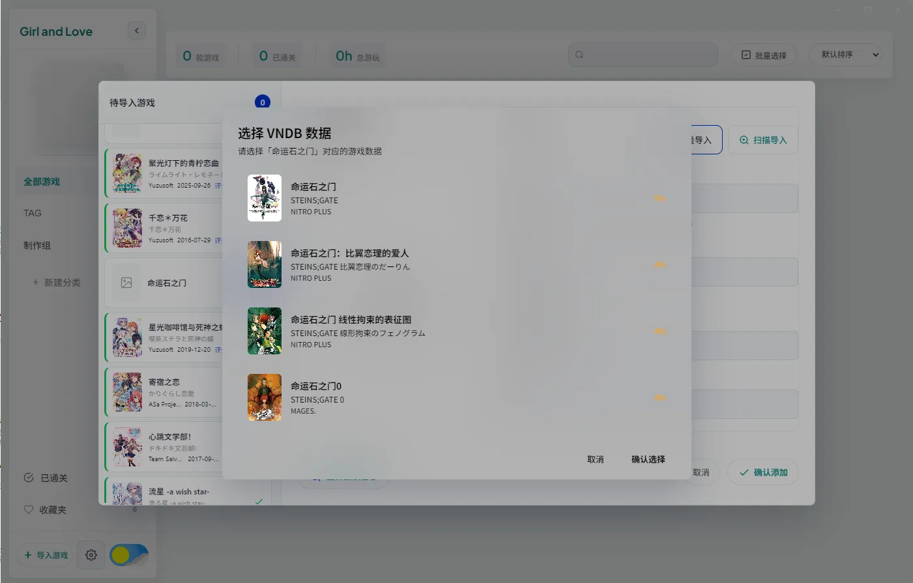

（多结果选择）


（详细内容界面）

* **卡片式游戏库**：支持搜索、分类、标签展示、游戏序号、封面模糊、批量选择和批量删除。游戏详情可编辑名称、路径、标签、简介、封面与截图。

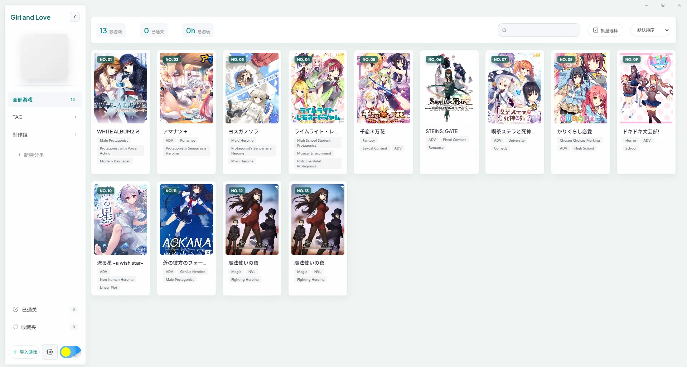

（主页面）

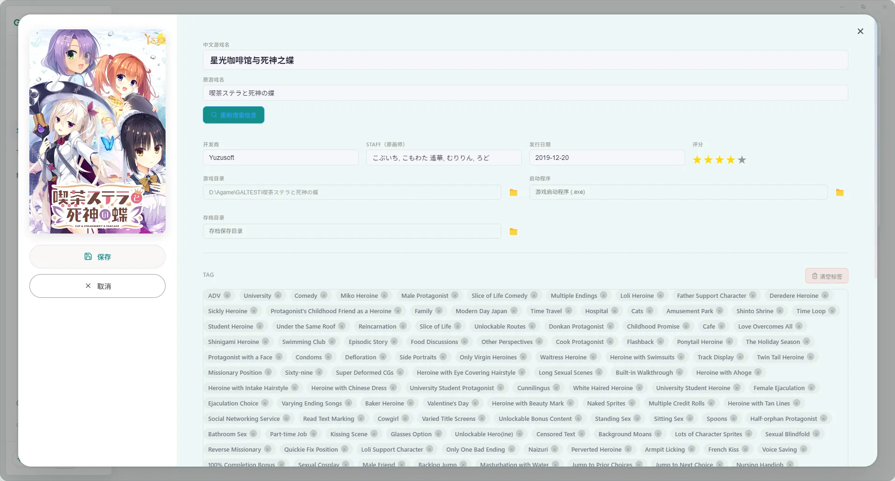

（编辑页面）

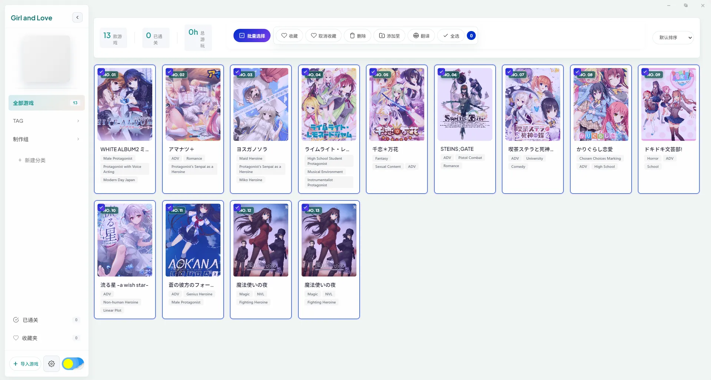

(批量操作)

* **本地资源缓存**：将下载的封面和截图保存到游戏库目录，减少重复获取远程图片。删除游戏记录时会清理其对应的本地资源目录；外部游戏安装目录不会因此删除。

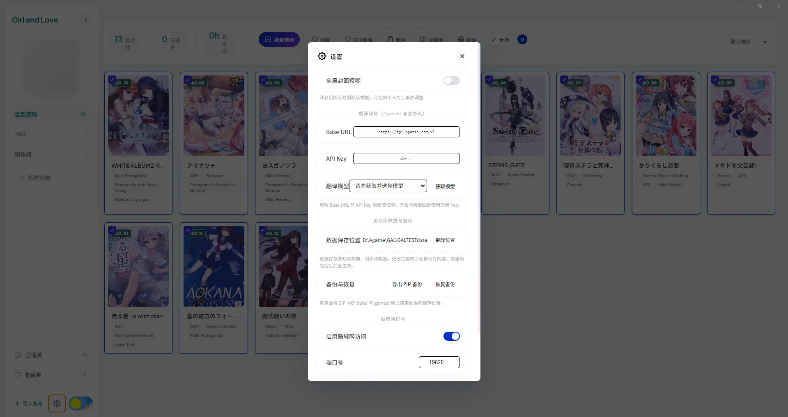

### 启动与游玩记录

* 从游戏详情启动本地可执行文件，记录游戏启动及累计游玩时长。

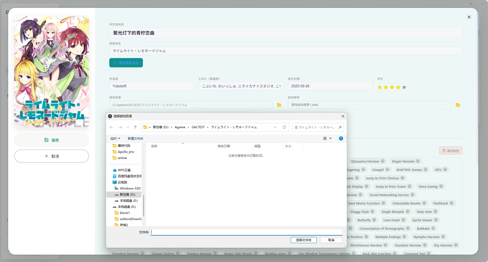

（调整启动路径）

* 可配置游戏目录、启动程序和存档目录；提供存档路径检测与打开目录入口。

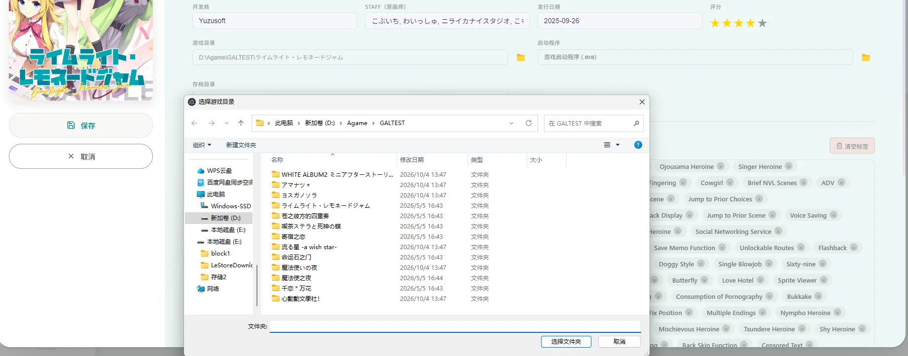

（配置目录）

* 集成 Locale Emulator 启动方式与 Magpie 缩放相关入口。相关功能依赖对应程序和本机环境。

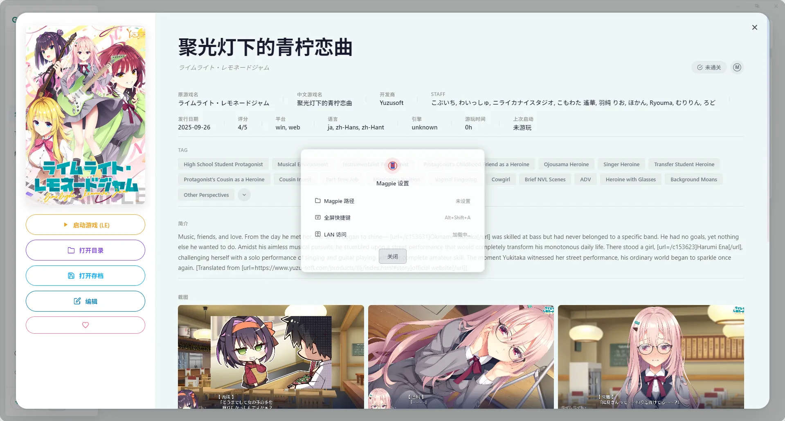

（集成LE转区工具 Magpie超分工具）

### 按需翻译

* 翻译服务使用 **OpenAI 兼容协议**：在设置中填写 Base URL、API Key，获取模型列表并选择模型。
* 翻译简介和标签需要先选中游戏，再点&#x51FB;**“翻译”**&#x6309;钮。导入游戏或重新搜索信息时保留原始文本，不会自动请求翻译服务。
* 模型列表使用 `GET /models`；翻译使用 `POST /chat/completions`。服务商需支持这些接口，且翻译请求需允许当前应用的网络访问。


（填入baseUrl 和 api 选择模型，启用翻译功能）

### 数据位置、备份与局域网访问

* 可在设置中查看并更改游戏库数据位置。更改位置时会迁移已有的 `data/` 和 `games/` 内容，建议重启应用后继续使用。
* 可导出 ZIP 备份，也可选择 ZIP 恢复到当前游戏库目录。备份包含应用数据和缓存资源，不包含导入时指向的外部游戏安装文件。
* 局域网内的其他设备可通过浏览器访问游戏库页面，查看游戏信息、封面和截图。可在设置中启用、停用或调整端口；默认端口为 `19820`。


（数据备份与恢复）


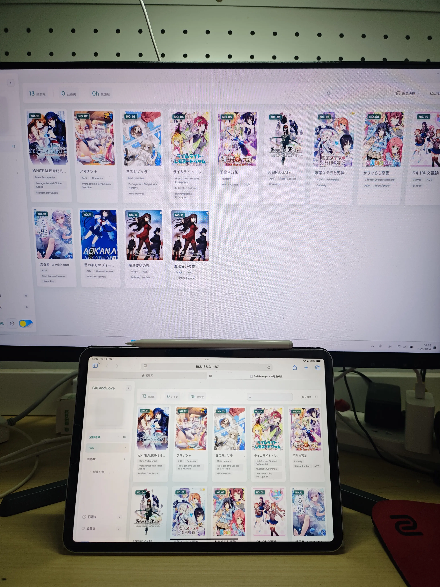

（局域网内设备可以通过浏览器访问，需要在电脑防火墙开放端口）

## 技术栈

| **部分** | **技术**                                    | **用途**                     |
| ------ | ----------------------------------------- | -------------------------- |
| 桌面运行环境 | Electron 33                               | 窗口、文件系统、进程与桌面集成            |
| 界面     | HTML、CSS、原生 JavaScript                    | 卡片布局、交互与游戏库渲染；本仓库界面不依赖 Vue |
| 进程通信   | Electron `preload.js`、`contextBridge`、IPC | 将文件操作、启动程序等主进程能力提供给界面      |
| 本地存储   | JSON 文件、图片文件                              | 保存游戏、分类、设置、封面和截图           |
| 游戏资料   | VNDB API                                  | 搜索和获取游戏元数据                 |
| 翻译     | OpenAI 兼容 API                             | 手动翻译简介与标签                  |
| 网络辅助   | `puppeteer-core`、Chrome 或 Edge            | 部分网络请求的浏览器代理               |
| 局域网服务  | Node.js `http`                            | 提供浏览器可访问的游戏库页面与资源          |
| 构建     | `electron-builder`                        | 生成 Windows 安装包及便携 EXE      |

## 目录结构

```text
galisland_code/
├─ app.js          # 界面状态、游戏库业务与交互
├─ main.js         # Electron 主进程、数据存取与局域网服务
├─ preload.js      # IPC 桥接
├─ index.html      # 应用页面结构
├─ style.css       # 应用样式
├─ package.json    # 依赖和构建脚本
├─ data/           # 开发模式下的 JSON 数据等
├─ games/          # 开发模式下缓存的封面和截图
├─ le/             # Locale Emulator 相关文件
└─ magpie/         # Magpie 相关文件
```

运行时游戏库根目录下的 `data/` 保存游戏、分类和设置等 JSON 文件，`games/` 保存封面及截图。开发模式默认使用项目目录；打包运行时默认使用 Electron 的用户数据目录。设置中选择新位置后，游戏库根目录改为该位置。位置配置文件 `storage-location.json` 仍保存在 Electron 用户数据目录。

## 本地开发与构建

**环境：** Windows、Node.js 与 npm。VNDB 检索和翻译需要联网；浏览器代理功能需要本机安装 Chrome 或 Edge。

```powershell
cd D:\GalSpace2\galisland_code
npm install
npm start
```

构建 Windows 便携版：

```powershell
npm run dist:portable
```

也可运行 `npm run dist:win` 构建 Windows 安装包和便携版。输出目录为 `release/`。打包配置及构建脚本见 `package.json`。

## 使用流程

1. 启动应用，点击侧边栏的“导入游戏”，选择单个或多个游戏目录，也可使用扫描导入。
2. 检查搜索到的 VNDB 候选信息，选择合适的条目并完成导入。必要时在游戏详情中编辑或重新搜索信息。
3. 如需翻译，在设置中填写兼容服务的 Base URL 和 API Key，获取并选择模型；回到游戏库选中游戏，点击“翻译”。
4. 在游戏详情中指定可执行文件及需要的存档目录，然后启动游戏。
5. 在设置中查看数据位置；需要迁移时选择新目录，需要备份时导出 ZIP。恢复备份后重启应用。
