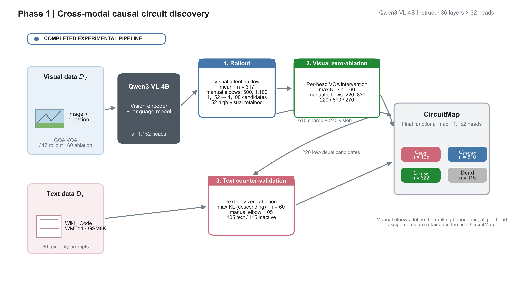
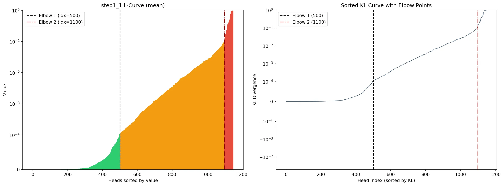
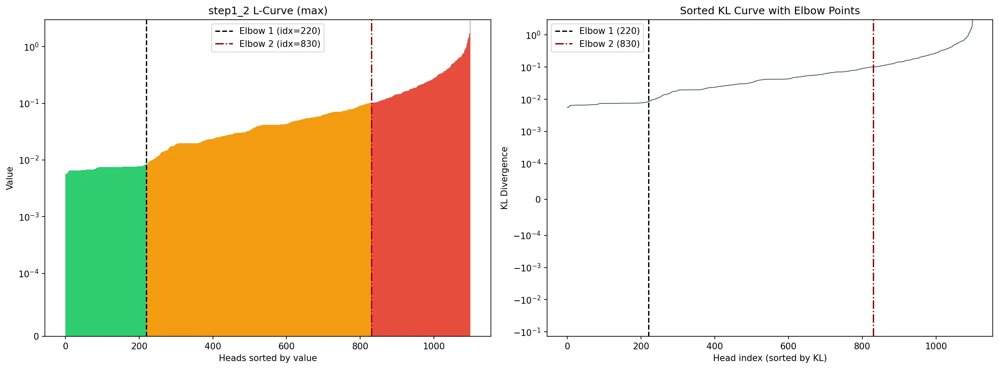
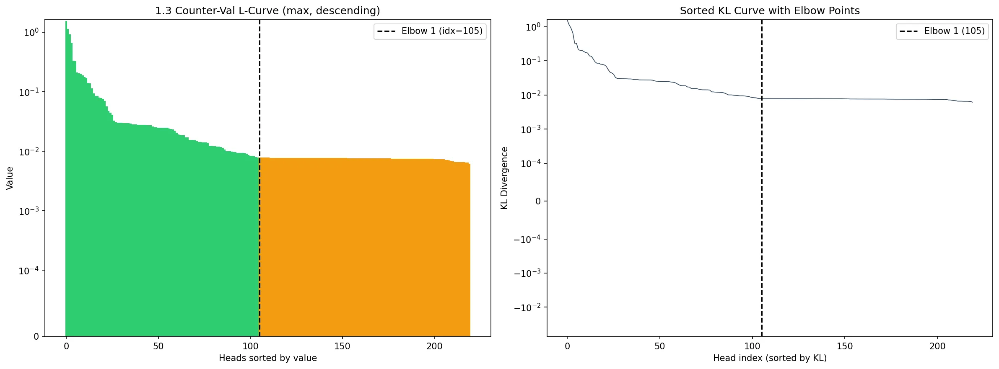
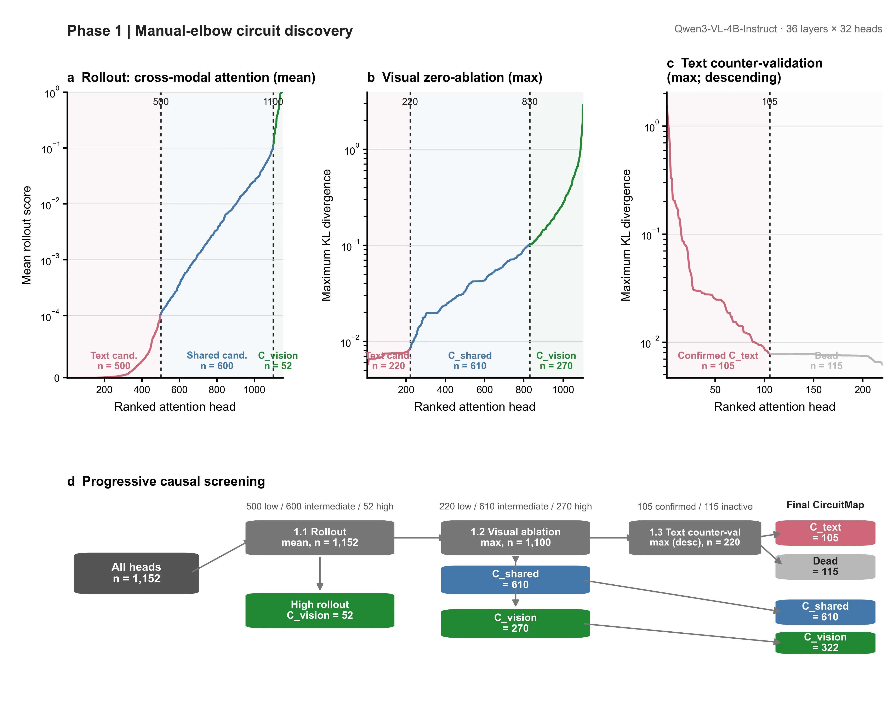
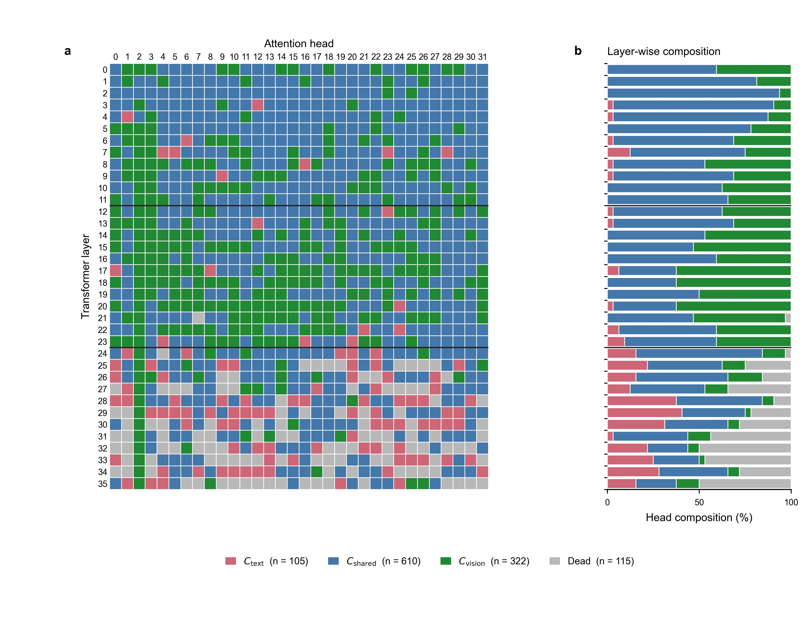
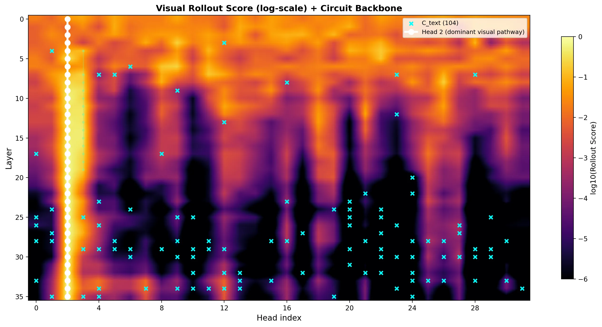
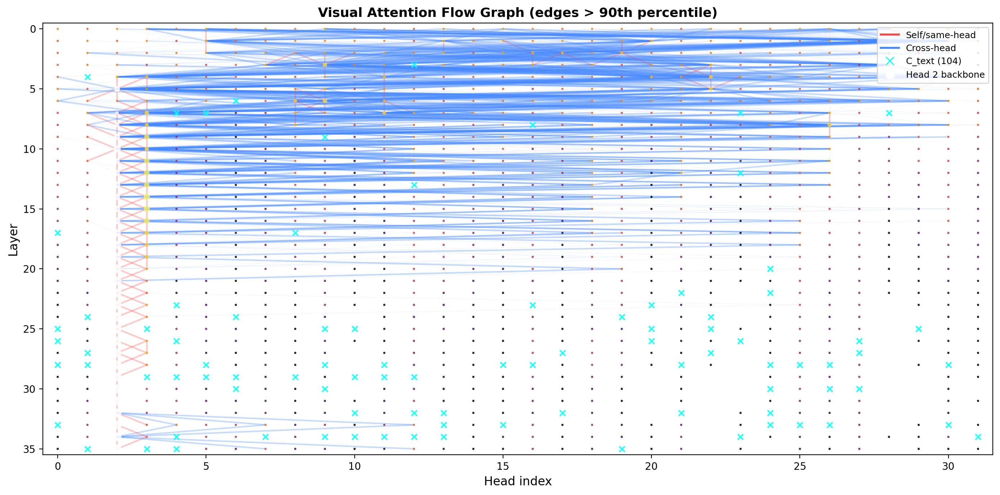
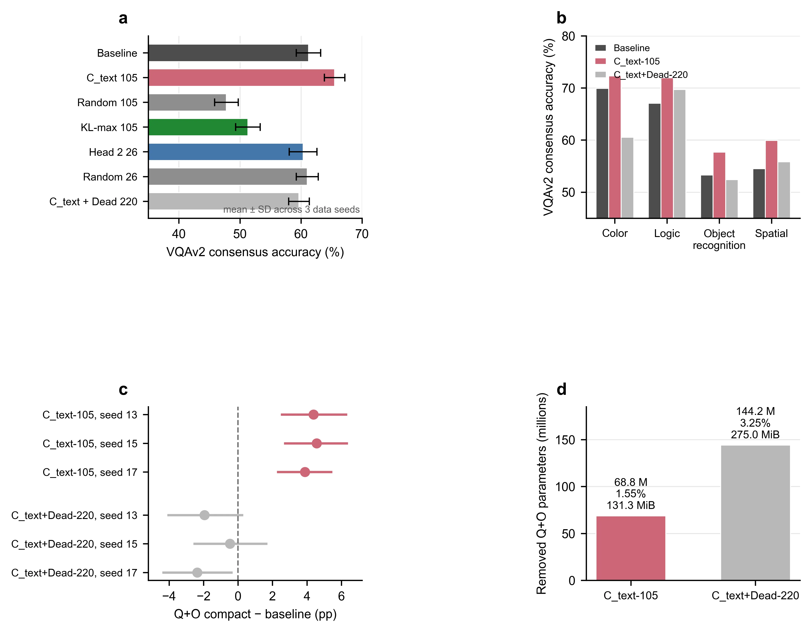

# 基于机理可解释性的 VLM 跨模态冗余回路精准剪枝：整体实验报告

实验时间：2026-07-20

能否先从视觉语言模型（VLM）的内部信息流中识别出对视觉问答冗余、却与文本计算有关的注意力头，再以因果消融和真实结构压缩验证其可移除性。实验对象为 `Qwen/Qwen3-VL-4B-Instruct`（BF16，36 个语言层、每层 32 个 query attention heads，共 1,152 个 heads）。

## 1. 研究目标与总体证据链

### 1.1 核心假设

VLM 的语言模型部分并非每个注意力头都同等服务于视觉推理。若一个 head 在视觉输入信息流中不活跃、在视觉输出上因果影响很小、但在纯文本输入中具有较大因果影响，则它是候选的文本专属回路（`C_text`）。对视觉专用部署而言，这类回路可成为可解释的结构化压缩对象,理想情况下，四类回路具有以下性质：

| **类别**    | **视觉敏感度 (V\_u)** | **文本敏感度 (T\_u)** | **部署策略**       |
| --------- | ---------------- | ---------------- | -------------- |
| C\_text   | 低                | 高                | 视觉专用部署中的主要剪枝对象 |
| C\_dead   | 低                | 低                | 可裁，但不构成文本特化证据  |
| C\_shared | 中或高              | 高                | 保留             |
| C\_vision | 高                | 相对较低或不确定         | 保留             |

### 1.2 四阶段设计

| **阶段**  | **要回答的问题**                           | **主要手段**                                 | **当前状态** | **可支持的证据**                 |
| ------- | ------------------------------------ | ---------------------------------------- | -------- | -------------------------- |
| 1. 回路发现 | 哪些 heads 具视觉、跨模态、文本或低活性特征？           | Rollout → 视觉零消融 → 文本反向验证                 | 已完成      | CircuitMap 与候选 `C_text` 集合 |
| 2. 因果验证 | 候选 `C_text` 在 VQA 上是否比随机 heads 更可丢弃？ | 运行时 head-output knockout、多组对照、VQAv2 共识评分 | 已完成      | 动态消融的任务级因果证据               |
| 3. 结构压缩 | 动态 knockout 是否能等价地永久化为真实 Q+O 压缩？     | 删除 Q/O 对应维度、紧凑前向、与 hook 配对比较             | 已完成      | 参数/存储缩减与功能等价性              |
| 4. 恢复训练 | 激进压缩点能否用小预算训练恢复？                     | 冻结主体、LoRA、答案 token 监督、匹配 SFT 对照          | 未执行      | 待验证，不能提前写入结论               |

## 2. 统一实验条件与数据概览

### 2.1 模型与资源

| **项目** | **配置**                                              |
| ------ | --------------------------------------------------- |
| 基础模型   | `Qwen/Qwen3-VL-4B-Instruct`                         |
| 推理精度   | BF16                                                |
| 模型规模   | 报告配置约 4.44B 参数                                      |
| 注意力结构  | 36 层 × 32 Q-heads；每 head 维度 128；共 1,152 heads       |
| GQA 约束 | 32 个 Q-head 对应 8 个 KV-head（4Q/1KV）；阶段 3 保留全部 K/V 投影 |
| 硬件     | RTX 2080 Ti（11 GB VRAM）与 64 GB RAM                  |
| 运行目录   | `outputs/run_20260720_211027/`                      |

### 2.2 数据来源、分布与隔离

| **阶段/用途**    | **数据来源**                                                                    | **样本量与分布**                                                                                      | **与其他阶段的关系**                 |
| ------------ | --------------------------------------------------------------------------- | ----------------------------------------------------------------------------------------------- | ---------------------------- |
| 阶段 1.1 视觉溯源  | Hugging Face `lmms-lab/GQA`                                                 | 317 个 VQA 样本，按 color、spatial、logic、object 四类覆盖                                                  | 用于视觉信息流发现                    |
| 阶段 1.2 视觉零消融 | 同一 GQA 样本池                                                                  | 60 个样本，四类各 15 个                                                                                 | 用于视觉因果敏感性筛选                  |
| 阶段 1.3 文本反证  | `Salesforce/wikitext`、`sahil2801/CodeAlpaca-20k`、`wmt14` de-en、`gsm8k` main | 60 个 prompts，wiki/code/translation/math 四来源各约 15 个                                              | 与视觉输入模态分离，用于确认文本侧影响          |
| 阶段 2、3 主评估   | Hugging Face `lmms-lab/VQAv2` validation                                    | data seeds 13/15/17；每 seed 1,000 条：四个关键词分层各 250 条；共 3,000 evaluation rows、2,976 个唯一 question id | 作为冻结的视觉任务评估集；不同 seed 有少量问题重叠 |
| 阶段 4 训练（计划）  | 官方 VQAv2 `train2014` questions、annotations 与 COCO `train2014` images        | 每个 training seed 1,200 条，四类各 300；seeds 101/202/303                                              | 与 VQAv2 validation 严格隔离      |

**分层的解释。**&#x56;QAv2 的四个类别由问题文本关键词构造，用于保证研究中的问题类型覆盖；它们不是 VQAv2 官方 question-type 标注。因此，overall VQAv2 consensus score 是主终点，分类型结果仅作诊断性/探索性分析。

**评分。**&#x9636;段 2 和 3 使用 VQAv2 十人答案的共识评分，而不是单一答案 exact match。对每题，答案先规范化，再依据十位标注答案中的匹配次数计算 `min(matches / 3, 1)` 并取 leave-one-annotator-out 平均。单题分数可为 0、0.3、0.6、0.9 或 1.0；报告数值为平均百分比。exact match 仅作为辅助量。

## 3. 阶段 1：跨模态 CircuitMap 发现

### 3.1 目的与方案

方法由三个由粗到细的步骤组成。视觉 Rollout 对全部 Head 进行相关性扫描；视觉零消融检验候选 Head 是否对视觉输出具有因果作用；文本反向消融排除全局低敏感 Head。三个步骤分别输出原始分数、max/mean 聚合结果和分类边界，最终合并为 CircuitMap



1. **1.1 Visual Token Attention Rollout：**&#x5728; GQA 图像—问题输入上追踪各 head 对视觉 token 的注意力传播，采用每 head 跨样本的 `mean` rollout score；人工复核 L-curve 后取肘部点 500 与 1,100。



2. **1.2 Per-head visual zero-ablation：**&#x9010; head 将 `o_proj` 输入前相应的 128 维注意力输出置零，比较视觉输入下消融前后的最后 token logits 的 KL 散度；采用 `max` KL，肘部点为 220 与 830。



3. **1.3 Textual counter-validation：**&#x53EA;输入纯文本 prompts，对 1.2 的候选进行同样的输出干预和 KL 比较；采用降序 `max` KL，肘部点为 105，用以确认文本影响显著的候选。



视觉 GQA 样本依次用于注意力 Rollout 与视觉零消融，纯文本的四来源 prompts 用于反向验证。三步输出共同决定最终 CircuitMap；图中数字对应固定的人工肘部选择。阶段 1 共评估 36×32=1,152 个 query heads。



### 3.2 阈值选择与最终分类

**图 2｜阶段 1 的手动肘部决策与因果筛选链。**&#x61;，Rollout 的 `mean` 分数以 500、1,100 为边界；b，视觉零消融的 `max` KL 以 220、830 为边界；c，文本反证的降序 `max` KL 以 105 为确认边界。Rollout 面板使用 0 与近零正刻度；KL 面板采用对数刻度。肘部为人工选择，故应在后续工作中用灵敏度分析检验其稳健性。

| **最终类别**   | **数量**    | **占 1,152 heads 的比例** | **操作性含义**                   |
| ---------- | --------- | --------------------- | --------------------------- |
| `C_text`   | 105       | 9.11%                 | 通过文本反向验证的文本专属候选；阶段 2/3 的主对象 |
| `C_shared` | 610       | 52.95%                | 保留；可能承担跨模态共享计算              |
| `C_vision` | 322       | 27.95%                | 保留；在视觉通路或视觉因果干预中显示重要性       |
| `Dead`     | 115       | 9.98%                 | 两侧低活性/未确认；不等于已证实可安全联合删除     |
| **总计**     | **1,152** | **100%**              | 36 层 × 32 heads             |

​



**图 3｜36 层 × 32 heads 的 CircuitMap。**&#x4E3B;热图以离散颜色标识每个 head 的最终类别，右侧显示全部 36 层的类别组成。颜色在本文中固定：`C_text` 为粉红、`C_shared` 为蓝、`C_vision` 为绿、`Dead` 为灰。图表说明候选头并非简单按层整体移除，而是具有 head 级的空间分布。

### 3.3 阶段 1 结果解读

阶段 1 的结果是一个**候选结构假设**，而不是“已安全剪枝”的证明。它最重要的产物是固定的 105-head `C_text` 列表及完整 CircuitMap。此前的视觉通路可视化显示 `C_text` 与观测到的视觉关键路径无重叠；然而，是否能在真实 VQA 任务上无损或获益，仍必须由阶段 2 的任务级干预验证。`Dead` 更不能因命名而自动并入剪枝集合，阶段 2/3 正是这一风险的实证边界。





## 4. 阶段 2：运行时因果 knockout 验证

### 4.1 目的与方案

阶段 2 在输出投影层之前将指定 head 的 128 维 attention output 置零。这个干预直接测试“移除该 head 的输出”对 VQA 表现的因果后果，而非仅比较激活或参数大小。每个 data seed 的 1,000 道题在所有非随机组中使用完全相同的样本顺序；随机组的 data-seed（抽题）与 control-seed（抽 head）彼此隔离。

| **组** | **干预集合**                 | **数量** | **对照目的**        |
| ----- | ------------------------ | ------ | --------------- |
| A     | 无消融                      | 0      | 原始模型基线          |
| B     | `C_text`                 | 105    | 主假设：文本候选的视觉可丢弃性 |
| C     | 全模型随机 heads              | 105    | 等规模随机对照         |
| D     | 1.2 中 `max` KL 最高的 heads | 105    | 验证视觉 KL 敏感性     |
| E     | Layer 10–35 的 Head 2     | 26     | 检验预设视觉骨干假设      |
| E2    | 全模型随机 heads              | 26     | E 的规模匹配对照       |
| F     | `C_text + Dead`          | 220    | 检验能否扩大剪枝集合      |

正式汇总使用 3 个 data seeds（13、15、17）与 3 个随机控制 seeds。对于 C、E2，先在每个 data seed 内对 3 个控制集合求平均，再跨 data seeds 汇总;

| **类别**             | **每个数据种子的样本数** | **三个数据种子的评估槽位数** |
| ------------------ | -------------- | ---------------- |
| Color              | 250            | 750              |
| Spatial            | 250            | 750              |
| Logic              | 250            | 750              |
| Object recognition | 250            | 750              |
| 合计                 | 1000           | 3000             |

三个子集并非完全不重叠：3000 个评估槽位对应 2976 个唯一问题。这种少量重叠来自独立随机抽样，不会改变每个种子内部严格均衡的类别构成。每道 VQAv2 题目均保留原始的 10 位人工标注答案。

### 4.2 总体结果与解释

| **组**               | **VQAv2 consensus score（%）** | **相对 A（pp）**     | **解释**               |
| ------------------- | ---------------------------- | ---------------- | -------------------- |
| A Baseline          | 61.21 ± 2.00                 | —                | 原模型                  |
| B `C_text`-105      | **65.48 ± 1.68**             | **+4.27 ± 0.35** | 主结果                  |
| C Random-105        | 47.77 ± 1.93                 | -13.44 ± 0.42    | 随机删头的平均损害很大          |
| D KL-max-105        | 51.29 ± 2.01                 | -9.92 ± 1.67     | KL-max 定位到功能敏感 heads |
| E Head-2-26         | 60.33 ± 2.27                 | -0.88 ± 0.40     | 不足以证明唯一视觉骨干          |
| E2 Random-26        | 61.00 ± 1.80                 | -0.21 ± 0.62     | 26-head 随机基线         |
| F `C_text+Dead`-220 | 59.65 ± 1.68                 | -1.56 ± 1.03     | Dead 不宜直接并入主剪枝集合     |

下表将三个数据种子的同类题目合并，每类共 750 个评估样本。

| **类别**             | **A：Baseline** | **B：`C_text`** | **B 相对 A** |
| ------------------ | -------------- | -------------- | ---------- |
| Color              | 69.93%         | 72.33%         | +2.40pp    |
| Logic              | 67.07%         | 71.96%         | +4.89pp    |
| Object recognition | 53.31%         | 57.68%         | +4.37pp    |
| Spatial            | 54.53%         | 59.96%         | +5.43pp    |

B 组在四个类别上均为正增益，没有出现“总体提升仅由某单一类别驱动”的现象。收益最大的是 Spatial（`+5.43pp`），其次为 Logic（`+4.89pp`）和 Object recognition（`+4.37pp`）；Color 也有稳定的正向提升（`+2.40pp`）。

这支持如下解释：`C_text` 头并不只是对某个狭窄题型无用，而更可能构成一种在跨模态 VQA 中引入冗余、竞争或干扰的文本侧计算成分。移除它们后，模型在空间关系、逻辑判断、物体识别和颜色判断上都获得改善。

D 组为何比 C 组高：KL-max 与随机消融的正确解读

D 组得分为 `51.29%`，高于 C 组的平均 `47.77%`，两者相差 `3.52pp`。这看似反直觉：如果 D 是 KL-max 最高的头，为什么其消融损害小于随机删 105 个头？关键是，C 组并不是稳定的随机基线，而是对具体随机抽到的 105 个头极其敏感：

| **control seed** | **C 组平均分数** | **相对 Baseline** |
| ---------------- | ----------- | --------------- |
| 23               | 61.32%      | +0.11pp         |
| 25               | 32.52%      | -28.69pp        |
| 27               | 49.48%      | -11.73pp        |

**KL-max 是视觉功能敏感性指标，但不是联合删头损害的全局排序。**&#x44; 组相对基线稳定下降 9.92 pp，说明阶段 1.2 的指标能找到视觉输出敏感 heads。D 组均值高于 C 组，不能反推 D 不重要：C 组的具体随机集合波动很大（control seed 23/25/27 的均值分别为 61.32%、32.52%、49.48%），且没有与 D 做层分布匹配。

## 5. 阶段 3：Q+O 真实结构化压缩

### 5.1 目的与结构方案

阶段 2 的 hook 置零不改变矩阵形状，不能自动带来参数或存储收益。阶段 3 因此将指定 Q-head 的 `q_proj` 对应 128 个输出行和 `o_proj` 对应 128 个输入列永久删除，形成紧凑 Q+O attention。为保持与阶段 2 干预一致，同时避免在 32Q/8KV GQA 中错误地将 Q-head 与 KV-head 一一对应，所有 K/V 投影均被保留；保留 Q-head 显式映射到原始 KV group `floor(original_q_head / 4)`。

评估包含三种同样本条件：A 原模型、B 动态 hook knockout、P Q+O compact。主目标为 `C_text-105`，激进边界为 `C_text+Dead-220`。每个 data seed 内 A/B/P 使用同一份 1,000 样本 manifest；P-A 的区间为逐题配对 bootstrap 95% CI。

### 5.2 逐 seed 的功能等价性

| **目标**            | **data seed** | **A 原模型** | **B Hook** | **P Q+O compact** | **P-A（pp）** | **P-A 95% CI**  | **P-B（pp）** |
| ----------------- | ------------- | --------- | ---------- | ----------------- | ----------- | --------------- | ----------- |
| `C_text`-105      | 13            | 59.76%    | 64.14%     | 64.14%            | +4.38       | \[+2.48, +6.34] | 0.00        |
| `C_text`-105      | 15            | 60.38%    | 64.94%     | 64.94%            | +4.56       | \[+2.67, +6.38] | 0.00        |
| `C_text`-105      | 17            | 63.49%    | 67.37%     | 67.37%            | +3.88       | \[+2.25, +5.47] | 0.00        |
| `C_text+Dead`-220 | 13            | 59.76%    | 57.83%     | 57.82%            | -1.94       | \[-4.10, +0.30] | -0.01       |
| `C_text+Dead`-220 | 15            | 60.38%    | 59.98%     | 59.92%            | -0.46       | \[-2.59, +1.70] | -0.06       |
| `C_text+Dead`-220 | 17            | 63.49%    | 61.13%     | 61.13%            | -2.36       | \[-4.39, -0.31] | 0.00        |



**图 4｜阶段 2–3 的因果验证与结构化压缩。**&#x61;，阶段 2 全部对照组的 VQAv2 共识分数；误差线为 3 个 data seeds 间标准差。b，三 seeds 合并后的关键词类别诊断，每类 750 evaluation rows，无误差线。c，阶段 3 中 Q+O compact 相对原模型的逐 seed 效应及 question-level paired bootstrap 95% CI；粉红为主压缩点、灰色为激进边界。d，实际删除的 Q/O 参数量；K/V projections 在 GQA 约束下保留。图中结果源数据见 `phase23_summary_source.csv`，图本身不报告吞吐或延迟。

### 5.3 参数、存储与结果分析

| **目标**            | **删除的 Q heads** | **删除 Q+O 参数** | **占约 4.4B 模型** | **BF16 权重理论减少** | **保存的 compact checkpoint** |
| ----------------- | --------------- | ------------- | -------------- | --------------- | -------------------------- |
| `C_text`-105      | 105             | 68,812,800    | 1.55%          | 131.3 MiB       | 约 8,348.6 MB               |
| `C_text+Dead`-220 | 220             | 144,179,200   | 3.25%          | 275.0 MiB       | 约 8,204.8 MB               |

`C_text`-105 是当前推荐的结构压缩点：其 P 模型在三个 seeds 上均比 A 高 3.88–4.56 pp，且与 B hook 的共识分数为 0.00 pp 差异。逐题检查中，seeds 13、17 的预测、score 和 exact match 完全一致；seed 15 有两条表面文本预测变化，但 score 和 exact match 不变。这支持“Q+O 压缩忠实复现了阶段 2 的 head-output knockout”这一实现正确性结论。

`C_text+Dead`-220 是必要的反例和压缩边界：它基本也复现了 hook 的功能后果，但相对原模型平均 -1.59 pp，seed 17 的配对区间为 \[-4.39, -0.31] pp。其主要类别损失来自 Color（-9.39 pp），因此不应作为当前默认视觉部署模型。更大的参数减少并不能抵消任务风险。

应同时注意三项边界：

* 当前 checkpoint 是由自定义 compact recipe/loader 使用；标准 Transformers config 不能直接表示逐层不同的 Q-head 数，尚不能当作普通 `from_pretrained` 部署验证。
* 尚未有在固定硬件与固定放置条件下的 latency、throughput、VRAM、prefill/decode 或端到端 VQA benchmark，因此不能宣称推理加速。
* 现有区间是 question-level bootstrap；同一图像的多问题相关性尚未通过 image-cluster bootstrap 纳入主统计。三个 data seeds 的 3,000 rows 也含 2,976 个唯一 question，跨 seed 平均应作为稳健性描述，而非高自由度独立重复。

## 6. 阶段 4：激进压缩的最小化恢复训练

### 6.1 为什么只对 220-head 点做恢复

`C_text`-105 在阶段 3 已通过功能与结构验证，既不需要、也不应为了“完成四阶段”额外训练。阶段 4 的唯一对象是 `C_text+Dead-220`：它具有更高的 Q+O 参数减少（144,179,200），但在视觉主终点上出现平均 -1.59 pp 的损失。阶段 4 研究的问题是：在**不重新引入已删 Q/O 维度**的条件下，有限预算的答案监督能否让这个激进结构相对同样微调的未剪枝模型达到非劣。

### 6.2 预注册式实验方案

| **要素** | **计划设置**                                                                                                      |
| ------ | ------------------------------------------------------------------------------------------------------------- |
| 训练起点   | 原模型 A1 与 `ctext_dead_220` 紧凑模型 P1；两者均训练，形成匹配 SFT 对照                                                           |
| 可训练参数  | 仅 LoRA / 指定小规模适配参数；基础模型和视觉编码器冻结                                                                               |
| 监督     | 仅 assistant answer tokens 参与 loss；system/user prompt、image tokens、padding 的 labels 为 `-100`                   |
| 训练数据   | 官方 VQAv2 `train2014`；每个 train seed 1,200 条，四类各 300                                                            |
| 训练种子   | 101（pilot）、202、303；全部保留，不按结果挑选                                                                                |
| 预算     | 每次 300 optimizer steps，约 1,200 个 micro-batch 样本前反向；不因结果不佳无限增加步骤                                               |
| 验证数据   | 冻结使用阶段 3 data seeds 13/15/17 的 manifests，不用于调学习率、rank、step 或 checkpoint                                       |
| 评估矩阵   | 3 training seeds × 3 validation data seeds × A1/P1 = 18 次评估                                                   |
| 主统计    | 对每个 validation seed，三个 training seeds 的 P1-A1 逐题差值平均后做 5,000 次 paired bootstrap；三组 95% CI 下界均须大于 -2.0 pp 才称非劣 |
| 稳健统计   | 另做 image-cluster bootstrap；这应成为论文的主 CI                                                                        |

阶段 4 的必要对照是 A1（未剪枝但做同样 SFT）与 P1（剪枝后做同样 SFT），而不是只比较 P1 和未训练的 P0。只有这一匹配设计才能区分“普通 SFT 带来的提升”与“剪枝后恢复的额外效果”。在全部 gates、数据 manifest 和评估协议冻结前，阶段 4 不应产生论文式性能结论。

### 6.3结果分析

阶段四目前完成的是 `training_seed=101`、`evaluation_seed=13` 的 pilot，不是完整 3×3 正式实验矩阵。结果文件为：

`outputs/run_20260720_211027/phase4/results/train_101/eval_13/phase4_evaluation.json`

**总体结果**

| **模型**        | **VQAv2 consensus** |
| ------------- | ------------------- |
| A0 原始模型       | 59.76%              |
| A1 原始模型 + SFT | 74.77%              |
| P0 压缩模型       | 57.82%              |
| P1 压缩模型 + SFT | 72.54%              |

关键差值：

* `P0 - A0 = -1.94 pp`：压缩确实造成损失。
* `A1 - A0 = +15.01 pp`：普通 answer-SFT 带来很大提升。
* `P1 - P0 = +14.72 pp`：压缩模型经过训练后恢复了绝大部分性能。
* `P1 - A1 = -2.23 pp`：P1 仍低于同样训练的 A1。
* Extra recovery：

```
(P1 - P0) - (A1 - A0) = -0.29 pp
```

**统计结论**

主比较 `P1 vs A1`：

* question bootstrap：`-2.23 pp`
* 95% CI：`[-3.53, -1.03] pp`
* image-cluster bootstrap：`-2.23 pp`
* 95% CI：`[-3.51, -1.01] pp`

因此，在当前 pilot 上：

> P1 相对 A1 存在统计显著的小幅劣势，且没有满足预先设定的 `-2.0 pp` 非劣界限。

也就是说，不能宣称 `ctext_dead_220` 经过 SFT 后已经达到与完整模型相同性能。不过，压缩模型恢复了约 `14.72 pp`，而原始压缩损失只有 `1.94 pp`，所以训练恢复效果很强。

Extra recovery 的 image-cluster CI 是：

```
-0.29 pp，95% CI [-2.62, +2.10] pp
```

它跨过 0，说明目前没有证据表明恢复超过普通 SFT 的作用。更准确的结论是：

> 同样的 VQA answer-SFT 可以显著恢复压缩模型性能，但当前 pilot 尚不能证明存在 pruning-specific 的额外恢复。

**分类别结果**

`P1 - A1`：

| **类别**              | **差值**   |
| ------------------- | -------- |
| color               | -2.36 pp |
| logic               | -0.96 pp |
| object\_recognition | -2.72 pp |
| spatial             | -2.88 pp |

损失主要集中在 `spatial` 和 `object_recognition`，而 `logic` 几乎恢复到完整模型水平。

**训练本身**

* A1：300 steps，loss `1.686 -> 1.532`
* P1：300 steps，loss `2.818 -> 1.641`
* 两者都完成了训练和重载 smoke test。
* P1 初始 loss 明显更高，符合压缩模型起点更差的预期。

当前结论只能称为 **pilot 结果**，不能作为阶段四最终结论。下一步应继续训练 `training_seed=202,303`，再评估全部 `data_seed=13,15,17`，然后看跨训练 seed 后 `P1-A1` 是否仍然低于 `-2 pp`。
