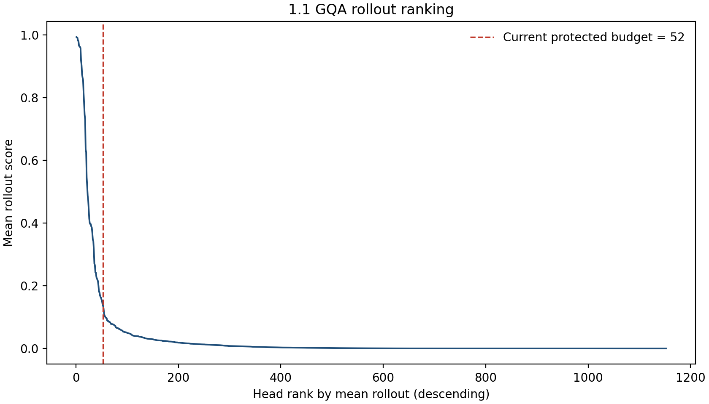
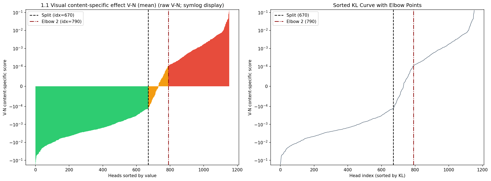
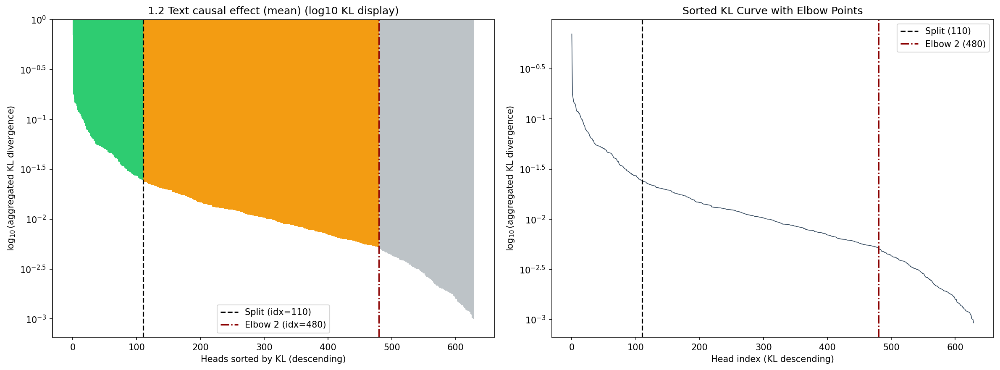
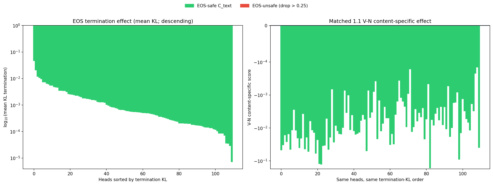
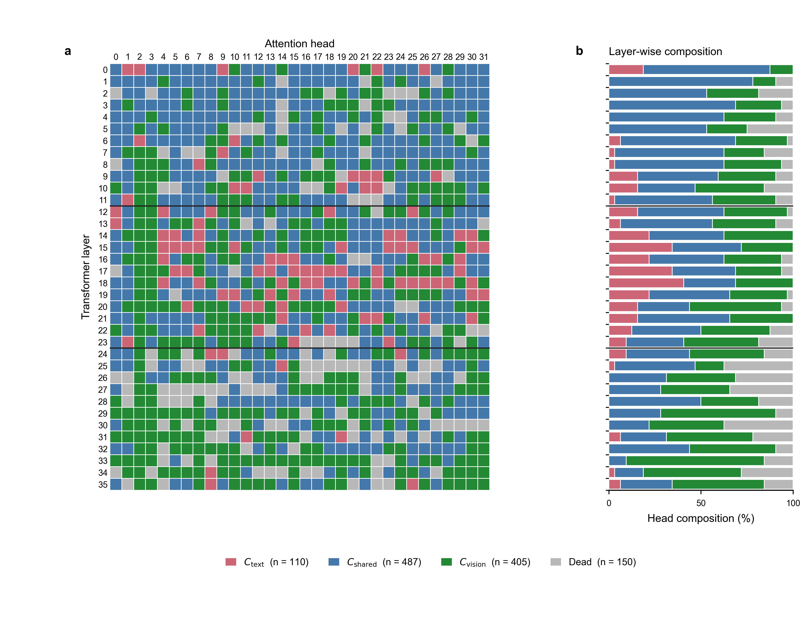

# 基于跨模态回路的VLM加速与视觉 Token 剪枝：`run_20260916_fft_vn` 实验报告

实验时间：2026 年 9 月。本文记录已完成的实验、能够支持的结论和仍待验证的假设。运行目录为 `outputs/run_20260916_fft_vn/`，模型为 `Qwen/Qwen3-VL-4B-Instruct`。

这轮实验最初想从跨模态信息流中找到可以安全删除的 attention heads，并将运行时消融转化为真实的结构压缩。结果与最初预期相反：删除本轮定义的 `C_text` 使 VQAv2 共识分数下降 **15.33 个百分点**；删除较低文本影响的 `Dead` 也下降 **4.49 个百分点**。结构压缩准确复现了消融行为，却没有带来端到端加速。随后开展的视觉 token 选择实验在温和保留率下接近完整模型精度，但计算选择分数本身需要额外的完整前向。

## 1. 研究目标与证据链

研究问题有两层：第一，能否用视觉与文本条件下的干预定位不同功能的 head；第二，这些功能标签能否转化为有实际收益的模型压缩或视觉 token 剪枝。

| 阶段 | 要回答的问题 | 主要干预或测量 | 本轮结论 |
|---|---|---|---|
| Phase 1 | 哪些 head 更依赖真实图像内容，哪些影响文本预测？ | 同 grid 的真图 V/FFT 图 N、单头消融、纯文本消融、EOS 筛查 | 得到完整 1,152-head 分类；分类是候选假设 |
| Phase 2 | 按类别整组删除是否保留 VQA 能力？ | 固定 VQAv2 样本上的 head-output knockout | `C_text` 和 `Dead` 均有显著损失 |
| Phase 3 | 动态消融能否忠实转化为 Q+O 紧凑模型？ | 删除 Q 行与 O 列，保留 K/V，并比较逐题输出和负载 | 行为一致；当前硬件上更慢 |
| 视觉 token 探索 | 视觉回路能否帮助逐题选择应保留的图像 token？ | R62/C_vision attention rollout 与 2×2 block 剪枝 | 75% 目标档接近 Full，但 teacher 计算昂贵 |

本报告区分三种证据：attention rollout 描述注意力路径；单头消融和整组 knockout 是模型行为干预；实际延迟与显存测量才说明当前实现的部署效果。三者不能互相替代。

## 2. 模型、数据与评价约束

### 2.1 模型和运行环境

| 项目 | 配置 |
|---|---|
| 模型 | Qwen3-VL-4B-Instruct，约 4.44B 参数 |
| 语言模型注意力 | 36 层 × 每层 32 个 Q-head，共 1,152 个；head 维度 128 |
| 图像预算 | `max_pixels=65536` |
| 推理提示 | 问题后附加 `Answer briefly in 1-2 words.` |
| 设备 | Windows、RTX 2080 Ti 11 GiB、64 GiB RAM |
| 注意力后端 | Windows 环境下使用 SDPA；不使用 FlashAttention2 |

收紧回答提示是为了降低“已经答对却继续生成”造成的 VQA 字符串匹配损失。它没有改变评分器，也意味着本轮 72.72% 的基线不能直接与使用旧提示词的 59%–61% 基线比较。

### 2.2 数据来源与用途

| 用途 | 数据集或来源 | 数量与分层 | 隔离关系 |
|---|---|---|---|
| Phase 1 视觉预处理、rollout、V−N | `lmms-lab/GQA` testdev balanced，本地 images 与 instructions 缓存 | 固定 100 题；color、spatial、logic、object recognition 各 25；选样 seed 42 | Phase 1 内复用同一 manifest |
| Phase 1 文本反证 | WikiText、CodeAlpaca、WMT14 de-en、GSM8K | 四来源各 25，共 100 条纯文本 prompt | 与视觉筛查模态分开 |
| Phase 2 knockout、Phase 3 compact | `lmms-lab/VQAv2` validation | data seed 13；四类各 250，共 1,000 题 | 各干预组使用同一批题 |
| 视觉 token early pilot | VQAv2 validation | data seed 21；四类各 25，共 100 题 | 用于早层评分器探索 |
| 视觉 token full teacher | VQAv2 validation | data seed 21；四类各 250，共 1,000 题 | R62 与 C_vision-405 在同一批题比较 |

这里的四类由项目代码按问题关键词启发式分层，并非 VQAv2 官方语义类别。VQAv2 的主指标是十位人工答案的官方 leave-one-annotator-out consensus；exact match 只作辅助诊断。

## 3. Phase 1：从内容差分到 CircuitMap

### 3.1 视觉依赖预处理：固定 100 道 GQA 题

首先对 GQA 候选图像寻找三张**处理后 image grid 完全相同**的自然替换图。原图与替换图的 `(t,h,w)`、视觉 token 数以及 M-RoPE 布局一致，因此图像替换后的输出分布变化不再混入“图像块数量改变”这一明显因素。按平均 image-swap KL 选出四类各 25 题，保存 source 图、替换图、grid 和分数到固定 manifest。后续 1.1 复用该 manifest。

候选池数量分别为 color 80、spatial 90、logic 95、object recognition 95；因为找不到同 grid 替换图而排除的数量分别为 3、0、5、2。该步骤选择视觉依赖较强的问题，但它本身不为任何 head 建立因果标签。

### 3.2 Step 1.1a：rollout 路由保护

在这 100 组图文输入上计算所有 1,152 个 head 的平均 attention rollout。分数最高的 62 个头记为 `R62`。它们仍参与后面的 V−N 计分；“保护”只影响最终类别合并，避免高 rollout 头因低差分值被直接送入文本/Dead 候选。Rollout 表示模型中的注意力传播路径，不能单独证明该头对答案必要。



### 3.3 Step 1.1b：真图 V 与 FFT 内容破坏图 N

对每张已选真图 V，使用**FFT 保幅、随机相位**生成内容破坏图 N。两者保留相同的尺寸、处理后 grid、视觉 token 数和 prompt。对每个 head 在 `o_proj` 之前单独置零，并在预测首个答案 token 的位置计算输出分布 KL：

```text
KL_V(h) = KL[p_V || p_(V,−h)]
KL_N(h) = KL[p_N || p_(N,−h)]
S_VN(h) = KL_V(h) − KL_N(h)
```

`S_VN` 为正，说明该头在真图条件下的消融影响大于 N 条件；为负则相反。两项 KL 各自非负，但相减后可以为负。代码对全部 1,152 个 head 逐一测量，并按跨 100 题的 `mean(S_VN)` 升序排列；手动肘部为第 670 和 790 名，原始分数阈值分别约为 `−1.304×10⁻⁴` 和 `+1.084×10⁻⁴`。由此得到低差分候选 670、中间带 120、较高差分 362。



图 2 的负数没有直接做普通 `log10`。排序依据始终为原始 `S_VN`；绘图的主坐标使用 `symlog`，附带的 plot-data 日志以 `sign(x)·log1p(|x|)` 保存显示值。接近零的 `10⁻⁴` 数值在 `signed_log1p` 下几乎保持原值，所以视觉上的“肘部”不能代替稳定性检验。

### 3.4 Step 1.2：纯文本反证

经过 R62 保护规则后，630 个低视觉内容差分候选进入文本筛查。对每个候选 head，在四种纯文本来源各 25 条 prompt 上做单头输出消融；比较最后一个 prompt 位置的 next-token 分布 KL，并按 100 条样本的平均文本 KL 降序排列。手动分点为 110 和 480：前 110 个称 `C_text`，中间 370 个进入共享类，最后 150 个称 `Dead`。



这里的 `C_text` 实际定义是“纯文本消融 KL 高”，表明它们对文本预测有功能影响；这个定义本身不支持“可在 VQA 中安全删除”。图 3 只对非负的文本 KL 取 `log10` 来展示数量级，分类仍按原始 KL 排名。

### 3.5 停止行为安全筛查与最终分类

先前实验出现“答案已经给出，却继续生成附加描述”的混杂。因此对最终 110 个 `C_text` 候选，用完整 gold answer 做 teacher forcing，在答案之后的位置测 EOS log-probability drop 与分布 KL。阈值为平均 EOS log-prob drop 不超过 0.25 nats。110 个候选均通过；最大平均 drop 仅 0.07225 nats。



这只说明它们在**这项 teacher-forced EOS 测试中**没有显著停止问题。它不能覆盖自由生成的全部停止行为，也不能证明答案内容或整组消融安全。

| 最终类别 | Heads | 层 0–11 | 层 12–23 | 层 24–35 | 平均层号 |
|---|---:|---:|---:|---:|---:|
| `C_text` | 110 | 21 | 80 | 9 | 16.12 |
| `C_shared` | 487 | 222 | 150 | 115 | 14.39 |
| `C_vision` | 405 | 100 | 133 | 172 | 20.21 |
| `Dead` | 150 | 41 | 21 | 88 | 21.29 |
| **合计** | **1,152** | **384** | **384** | **384** | — |

R62 是最终 `C_vision` 的子集。`C_vision=405` 包含高 V−N 区间与 rollout 保护头，因此并非单纯“405 个经因果证明必需的视觉头”。



与此前 `run_20260907_visual_65536` 的图相比，本轮 `C_vision` 从 132 增至 405，逐 head 类别也大幅变化。新的图应作为**当前协议的分类结果**来读，不能把视觉头数量增加直接解释为视觉回路定位更准确。

## 4. Phase 2：按组 knockout 的 VQA 因果检验

### 4.1 实验方案

VQAv2 validation 的同一份 1,000 题 manifest 在各组间共享。每个被选中的物理 Q-head 的 128 维输出在 `o_proj` 输入前置零；ViT 特征在组间复用。`data_seed=13` 决定题目，`control_seed` 只改变随机 head 集合。报告以 `control_seed=103` 的最终合并 `phase2_comparison_v7_merged.json` 为准，其中 D 已修正为 **mean(V−N) 对照**；旧文件中的 `D_KLmax` 不用于本轮结论。

| 组 | 消融对象 | 数量 | 要检验的区别 |
|---|---|---:|---|
| A | 无 | 0 | 原模型基线 |
| B | `C_text` | 110 | Phase 1 文本组是否可用于 VQA 剪枝 |
| C | 层匹配随机 heads | 110 | 相同数量和层分布的随机删除损伤 |
| D | 非 `C_text` 的 mean(V−N) 最高 heads | 110 | 高视觉内容差分头的整组损伤 |
| E | 层 10–35 的 head 2 | 26 | 旧数据回路假设 |
| E2 | 随机 heads | 26 | E 的等量随机参照 |
| F | `C_text ∪ Dead` | 260 | 激进合并删除 |
| G | `Dead` | 150 | 低文本影响组是否真正可删 |

### 4.2 结果

| 组 | Consensus | 相对 A | Exact match | 主要解释 |
|---|---:|---:|---:|---|
| A Baseline | **72.72%** | — | 62.0% | 原模型 |
| B `C_text` | 57.39% | **−15.33pp** | 49.5% | 文本组整组删除严重有损 |
| C Random-110 | 62.98% | −9.74pp | 53.1% | 随机删除也有明显风险 |
| D V−N-110 | 60.10% | −12.62pp | 50.4% | 高差分头也承担任务功能 |
| E head2-26 | 71.77% | −0.95pp | 61.2% | 影响较小 |
| E2 Random-26 | 71.73% | −0.99pp | 61.5% | 与 E 接近 |
| F `C_text+Dead` | 37.78% | −34.94pp | 32.6% | 激进合并不可用 |
| G `Dead`-150 | 68.23% | **−4.49pp** | 58.9% | 相对低影响，但仍显著有损 |

随机 C 在 `control_seed=101/102/103` 下分别为 67.64%、60.46%、62.98%。即使层分布匹配，联合随机删除的波动也大，因此单个随机集合不足以建立强机制结论。`Dead` 的配对 bootstrap 95% 区间为 **[−6.11, −2.83]pp**，没有覆盖零。

这轮实验直接否定了“本轮 `C_text` 可安全剪除”的主假设。EOS 筛查通过也没有消除完整 VQA 生成中的功能损伤。

## 5. Phase 3：Dead-150 的 Q+O 结构化压缩

动态 hook 把 head 输出置零，却不改变矩阵形状。为检验真实结构压缩，Phase 3 删除 `Dead` 150 个 Q-head 对应的 `q_proj` 输出行和 `o_proj` 输入列；保留全部 K/V，以维持 GQA 的 KV 分组与生成 cache 结构。评估复用 Phase 2 的 1,000 题 VQAv2 manifest。

| 结构指标 | 结果 |
|---|---:|
| 删除 Q-head | 150/1,152，即 13.02% |
| 剩余 Q-head | 1,002 |
| 删除 Q+O 参数 | 98,304,000 |
| 总参数变化 | 4,437,815,808 → 4,339,511,808，减少 2.215% |
| 理论 Q+O MAC 节省 | 每 token 98,304,000 |

| 模型 | Consensus | Exact | 1,000 题总时间 | 吞吐量 | 峰值 CUDA allocated |
|---|---:|---:|---:|---:|---:|
| Baseline | 72.72% | 62.0% | 521.74 s | 1.9167 题/s | 8.27 GiB |
| Hook Dead-150 | 68.23% | 58.9% | 570.73 s | 1.7521 题/s | 8.27 GiB |
| Q+O compact Dead-150 | 68.23% | 58.9% | 578.27 s | 1.7293 题/s | 8.09 GiB |

Hook 与 compact 的逐题 score 一致，说明结构实现忠实复现了本次干预。相对原模型，compact 仍损失 **4.49pp**。峰值显存减少约 0.18 GiB，但在当前 Windows + SDPA 实现中，1,000 题用时从 521.74 s 增至 578.27 s；理论 MAC 节省没有转化为实测加速。

## 6. 视觉 token 剪枝：保留 head，缩短逐题视觉序列

### 6.1 token 分数与选择规则

视觉 token 策略从另一角度减少负载：先用完整图像运行 ViT，得到语言模型输入的视觉 token，然后在 spatial merge 后的 LLM visual grid 上按 `2×2` 空间 block 分组。一个 block 内的 token 同留同删。保留若干 block 后，同步缩短 `inputs_embeds`、`attention_mask`、`visual_pos_masks`、DeepStack visual embeddings 与 3D M-RoPE `position_ids`，重新进行完整的 LLM prefill 和生成。ViT 编码成本仍完整保留。

`R62 full-rollout teacher` 的计算更具体：以图像之后的有效问题文本位置作为初始位置分布，不使用尚未生成的答案 token；每层平均 attention 与单位矩阵各占一半构造传播矩阵。对 R62 中每个指定 head，单独把其所在层的平均 attention 替换为该 head 的 attention，回溯到输入视觉位置；62 条归因平均得到逐视觉 token 分数。代码随后对每个 `2×2` block 的 token 分数取均值，按分数排序取前 `ceil(block 数 × 目标保留率)` 个 block。

这个分数衡量的是 attention 路径归因，并非直接观测到的“答案因果贡献”。当前实现从所有图后问题文本位置等权出发；若要更贴近首个答案 token，应另行比较仅用最后一个 prompt 位置作为起点的版本，不能预设优劣。

### 6.2 早层 6-head proxy：100 题

首先在 VQAv2 `data_seed=21` 的 100 题上，用 R62 中位于层 0–4 的 6 个 head 计算问题文本到视觉 token 的**直接** attention，作为低开销 proxy。`Random` 随机取 block；`Uniform` 尽量均匀覆盖网格。

| 方法 | Full | 75% 目标 | 50% 目标 | 25% 目标 |
|---|---:|---:|---:|---:|
| Random | 66.64% | 66.44% | 60.05% | 54.86% |
| Uniform | 66.64% | 67.24% | 64.54% | 52.95% |
| Early circuit | 66.64% | 67.86% | 61.06% | 50.35% |

75% 档的差距来自仅 100 题，且 early circuit 相对 Uniform 的配对区间跨零；50% 和 25% 档反而较差。这个 6-head 直接 attention 方案目前不足以作为部署选择器。

### 6.3 R62 full-rollout teacher：1,000 题

在同一 data seed 下扩展到四类各 250、共 1,000 题。下表将目标保留率、因 block 向上取整形成的实际视觉 token 保留率，以及评分时间分别列出。

| 方法 | Consensus | Exact | 实际视觉保留 | KV cache 降幅 | 剪枝后生成/题 | Teacher 评分/题 |
|---|---:|---:|---:|---:|---:|---:|
| Full | **73.92%** | 64.0% | 100% | 0% | 0.390 s | — |
| Random 75% | 70.93% | 61.3% | 79.56% | 13.75% | 0.390 s | — |
| Uniform 75% | 71.92% | 62.2% | 78.51% | 14.46% | 0.392 s | — |
| R62 75% | **73.20%** | 63.1% | 79.71% | 13.65% | 0.400 s | 0.331 s |
| Random 50% | 67.74% | 57.6% | 53.01% | 31.60% | 0.364 s | — |
| Uniform 50% | 66.17% | 56.1% | 49.18% | 34.17% | 0.355 s | — |
| R62 50% | **67.85%** | 58.7% | 53.55% | 31.24% | 0.358 s | 0.331 s |
| Random 25% | 57.92% | 49.3% | 26.48% | 49.43% | 0.358 s | — |
| Uniform 25% | 57.63% | 48.4% | 23.36% | 51.53% | 0.355 s | — |
| R62 25% | 56.03% | 47.5% | 25.88% | 49.84% | 0.352 s | 0.331 s |

R62 的 75% 目标档相对 Full 为 **−0.72pp**，95% 配对区间 **[−1.87, +0.39]pp**；相对 Uniform 为 +1.28pp，区间 **[−0.16, +2.73]pp**，尚未证实它确实优于 Uniform。50% 档相对 Full 损失 6.07pp，25% 档进一步恶化。

R62 评分需要一次完整的 eager-attention 前向，约 0.331 s/题；75% 档剪枝后生成仍需 0.400 s/题。因此它是离线 token 选择 teacher，当前不能宣称端到端加速。若将两段串行用时粗略相加，75% 档约 0.731 s/题；这只是阶段计时之和，不是独立完成的部署 benchmark。

### 6.4 将 R62 扩展为全部 C_vision-405

保持同一 1,000 题和 full-rollout 算法，只将显式归因 head 从 62 个增加到 405 个。

| 目标保留率 | R62 consensus | C_vision-405 consensus | C405−R62 | 1,000 题中 mask 不同 |
|---|---:|---:|---:|---:|
| 75% | 73.20% | 73.20% | 0.00pp | 12 题 |
| 50% | 67.85% | 67.92% | +0.07pp | 21 题 |
| 25% | 56.03% | 56.07% | +0.04pp | 10 题 |

C405 的评分用时为 0.416 s/题，比 R62 的 0.331 s/题高约 26%，而 mask 与精度几乎不变。这说明“加入更多被标为视觉的 head”在当前归因算法下没有可辨认的选择收益。可能原因包括共享层传播矩阵或 identity 项主导、R62 已近似覆盖主要排序信息；现有结果无法在这些解释之间作出判定。

## 7. 对本轮方法的复盘

本轮最重要的教训来自 Phase 1 的分类逻辑，而非绘图本身。

**第一，`KL_V−KL_N` 只能衡量条件差异，不能衡量删除安全性。** 假设一个头在 V 和 N 条件下的 KL 都很高，差值仍可能接近零；因此低差分不意味着真图上低影响。负差值也可能表示 N 条件更敏感，而非 V 条件无用。本轮以单个差值从小到大分段，容易混合低影响头、重要共享头和对 FFT 异常输入敏感的头。

**第二，视觉分点处非常靠近零。** 人工分点对应的原始值约为 `−1.304×10⁻⁴` 与 `+1.084×10⁻⁴`。把稍高于零的大量 head 归入 `C_vision`，并不能证明每个头有稳定的视觉内容因果作用。这可以解释当前 CircuitMap 与之前实验的逐层分布明显不同，但仍需进一步测量才能确认具体误分类数量。

**第三，`C_text` 被定义为纯文本 KL 最高的头。** 它们从操作上更接近“文本功能头”，不是“文本冗余头”。Phase 2 的 −15.33pp 与这个定义一致。EOS 检查只覆盖一个停止指标，不能把高文本 KL 转化为安全剪枝证据。

因此，当前四类标签保留为本轮协议下的探索性分组，不把 `C_text` 或 `Dead` 宣称为可安全删除集合。今后的候选筛选应同时保留真图绝对影响 `KL_V`、FFT 条件影响 `KL_N`、二者差值、纯文本 KL 和生成停止行为；整组删除仍须由独立任务评估裁决。若使用真实图与内容破坏图做 activation/path patching，也应明确替换的激活位置，并与真图零消融联合解释。

## 8. 可支持的结论与下一步

1. 本轮 Phase 1 形成了覆盖全部 1,152 个 Q-head 的 CircuitMap，但现有差值分段和类别名称尚不足以支持安全剪枝。
2. 在固定的 VQAv2 1,000 题上，整组删除 `C_text` 和 `Dead` 分别损失 15.33pp 与 4.49pp；本轮 head pruning 主假设未通过任务检验。
3. Dead-150 的 Q+O compact 与 hook 行为一致，删除约 9,830 万参数；当前 Windows + SDPA 后端没有实测加速。
4. R62 full-rollout 在约 80% 实际视觉 token 保留时接近 Full 精度，但 teacher 额外前向抵消了潜在在线收益；C405 没有改善 mask 或精度。
5. 下一步先核对 R62/C405 的 block score 排名、集中度与 mask 重合，再尝试只依赖 ViT embedding、问题 embedding 或少量早层计算的低开销选择器。报告应同时给出选择器开销和完整推理延迟。

## 9. 图表、原始数据与复现入口

本文 `attachment/` 中的五张图均为现有 run 图表的拷贝；文件名只服务于文章引用，原始实验文件未被改写。图片拷贝不替代原始数据、脚本或 checkpoint。

| 本文图 | 原始产物 |
|---|---|
| 图 1 rollout 排名 | `phase1/phase1_1/step1_v2_1_rollout_filter_ranking.png` |
| 图 2 mean V−N | `phase1/phase1_1/step1_v2_1_visual_content_difference_mean.png` |
| 图 3 文本 mean KL | `phase1/phase1_2/step1_v2_2_text_counter_mean.png` |
| 图 4 EOS 与内容 | `phase1/phase1_1/step1_v2_1_final_termination_vs_content.png` |
| 图 5 CircuitMap | `phase1/phase1_3/circuit_map_distribution.png` |

这些相对路径均以 `outputs/run_20260916_fft_vn/` 为根目录。关键原始结果为：

- Phase 1 map：`phase1/phase1_3/circuit_map_phase1_v2.pkl`。
- Phase 2 最终结果：`phase2_results/data_13_control_103/phase2_comparison_v7_merged.json`。旧 `v4` 的 D 仍是 `KLmax`，不可混用。
- Phase 3：`phase3/results/data_13/dead_150/phase3_qo_evaluation.json`，紧凑模型在 `phase3/models/dead_150/`。
- Token early pilot：`visual_token_pruning/data_21/pilot.json`。
- R62 teacher：`visual_token_pruning/teacher_data_21/pilot.json`。
- C405 teacher：`visual_token_pruning/teacher_cvision_data_21/pilot.json`。

本轮主结论均限于 Qwen3-VL-4B-Instruct、固定图像预算、上述样本和当前 Windows + SDPA 实现。CircuitMap 分点由人工选择；Phase 2/3 主评估只有一个 data seed；question-level bootstrap 尚未按同图多问题做 image-cluster 修正。因此本文适合作为这一 run 的完整实验记录，暂不把分类或速度结果概括为跨模型、跨数据集的普遍结论。
