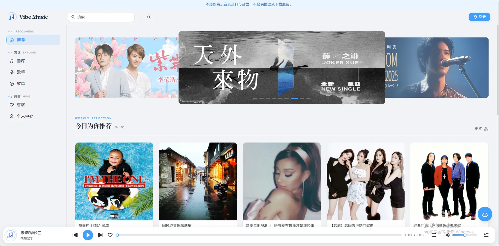
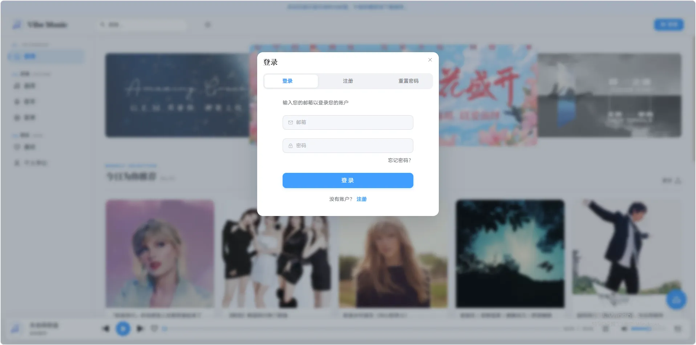
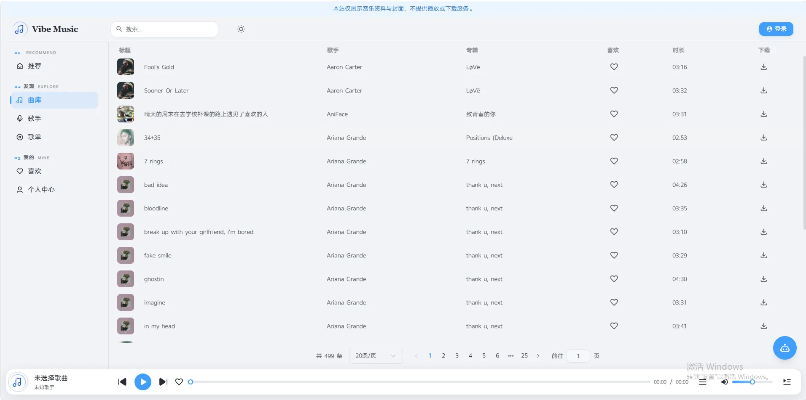
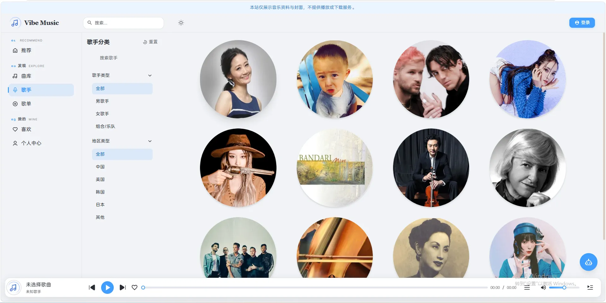
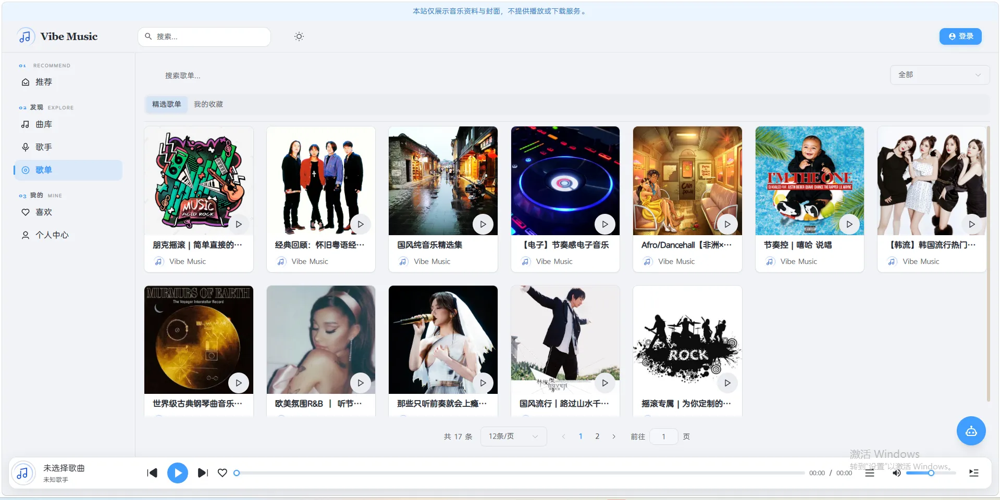
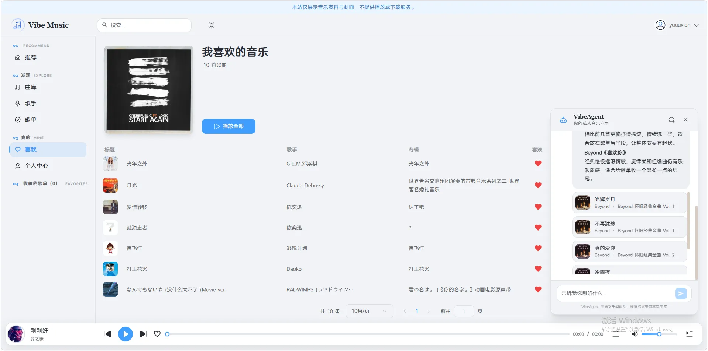
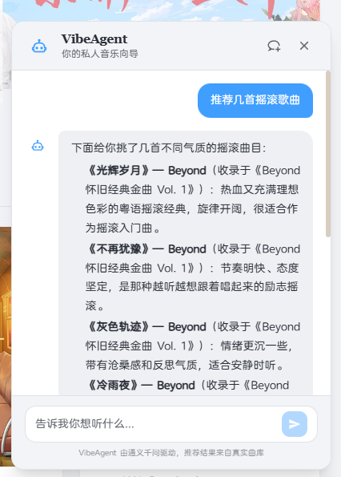
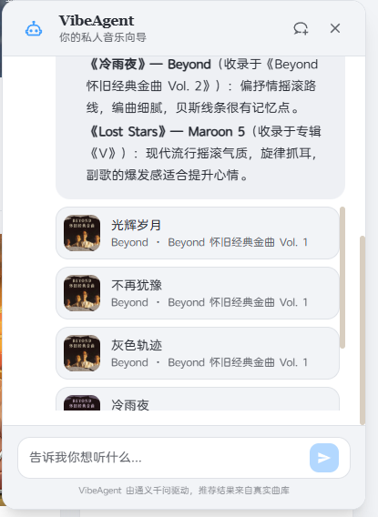
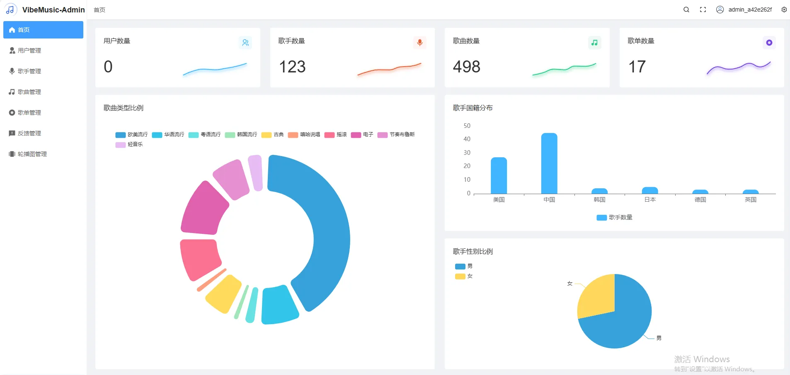

# Vibe Music 项目文档

> 云部署地址：https://music.yuuuxion.xyz/](https://music.yuuuxion.xyz/)
>
> github开源地址：[[anyayuqiu/vibe-music: Vibe Music — 音乐资料展示站与 AI 音乐助手](https://github.com/anyayuqiu/vibe-music)](https://github.com/anyayuqiu/GalSpace2)
>
> 依据 2026 年 9 月当前工作区代码整理, 本文描述的是现在准备部署的“音乐资料展示站”版本, 仓库中仍保留部分原音乐播放器代码，因为版权原因开站点不提供音频服务。

## 1. 项目定位

Vibe Music 由访客使用的客户端、内容管理端和 Java 服务端组成。网站展示歌曲、歌手、歌单、封面和相关资料，支持用户账号、收藏、评论、反馈与 AI 音乐资料助手。管理端维护站内数据及图片。封面、头像等图片存放在 MinIO，结构化数据存放在 MySQL。

当前公开站点明确提示“仅展示音乐资料与封面，不提供播放或下载服务”。客户端点击播放会显示版权提示，不加载音频元素；服务端的音频上传接口直接返回拒绝结果。正式部署前还应清空历史歌曲的 `audio_url`。管理端和仓库中仍留有部分播放器与音频上传界面代码，不能将其视为生产展示站的既定功能。

## 2. 系统组成与数据流

| **模块** | **目录**                             | **作用**                         |
| ------ | ---------------------------------- | ------------------------------ |
| 客户端    | `vibe-music-client/`               | 向访客展示音乐资料，提供用户操作和 AI 助手        |
| 管理端    | `vibe-music-admin/`                | 管理歌曲、歌手、歌单、用户、反馈与轮播图           |
| 后端     | `vibe-music-backend/`              | HTTP API、认证授权、业务逻辑、数据访问与 AI 编排 |
| 数据库脚本  | `sql/vibe_music.sql`               | MySQL 表结构与示例数据                 |
| 部署文档   | `docs/Ubuntu-Docker-Compose-部署.md` | Ubuntu 24.04 上的 Compose 部署模板   |

```text
访客浏览器 / 管理员浏览器
        │ HTTPS
        ▼
  Caddy（静态页面 + /api + /media）
        ├── /api   → Spring Boot → MySQL / Redis / MinIO / AI 模型服务 / SMTP
        └── /media → MinIO 中公开读取的封面和头像
```

```
vibe-music/
├── vibe-music-client/           # 用户端 Vue 应用
├── vibe-music-admin/            # 管理端 Vue 应用
├── vibe-music-backend/          # Java 多模块工程
│   ├── vibe-music-server/       # API、业务、数据访问、AI
│   ├── vibe-music-model/        # Entity、DTO、VO
│   └── vibe-music-common/       # 常量、枚举、通用工具
├── sql/                         # MySQL 建表与示例数据
└── docs/                        # 项目说明与部署文档
```

客户端与管理端是独立的 Vue 单页应用，可以使用不同子域名。生产环境 API 使用同源 `/api`，由反向代理去掉该前缀再转发到 Java 服务。MinIO 有内部连接地址和图片公开地址两种用途：Java 通过内部地址操作对象，浏览器通过 HTTPS `/media` 加载图片。

## 3. 主要功能与特点

### 3.1 客户端

* **资料浏览**：首页轮播图、推荐歌单和歌曲；按列表浏览歌曲、歌手、歌单，查看歌手与歌单详情及封面。
* **搜索与筛选**：歌曲库、歌手和歌单页面提供查询入口；歌曲资料由服务端 API 返回。
* **账号功能**：邮箱验证码注册、登录、密码重置、个人信息与头像修改、退出登录。登录状态由前端状态管理与服务端 JWT/Redis 共同维护。
* **互动功能**：收藏歌曲和歌单、歌曲或歌单评论、评论点赞、意见反馈。
* **展示模式**：保留部分播放器外观和代码，但当前播放操作只给出版权提示，不请求或播放音频。上线前应核查所有历史音频 URL。
* **AI 音乐资料助手**：登录用户可提问音乐相关问题。回复正文通过 SSE 流式呈现；推荐曲目以独立卡片展示封面、歌名、歌手与专辑。会话 ID 存在浏览器本地存储，刷新后可延续当前会话。
* **界面**：浅色主题以管理端的 `#409EFF` 蓝色为主色，保留客户端响应式布局、组件动画与深色模式支持。



<div align="center"> 主页面</div>







<div align="center"> 功能页面一</div>





<div align="center"> 功能页面二</div>





<div align="center"> Agent功能</div>

### 3.2 管理端

* **概览面板**：汇总用户、歌手、歌曲、歌单等数量，并用图表展示统计信息。
* **内容维护**：歌曲、歌手、歌单的列表查询、增加、编辑、删除及封面/头像维护；歌单可绑定或移除歌曲。
* **用户与反馈**：查看用户，修改用户资料或状态，管理反馈；部分删除操作受数据库外键约束，关联反馈的用户不能直接删除。
* **页面运营**：维护首页轮播图及其状态。
* **管理员登录**：使用单独的管理员账号和权限；初始管理员可在管理员表为空时由环境变量创建。



### 3.3 服务端与 AI

* **业务 API**：提供用户、歌曲、歌手、歌单、收藏、评论、反馈、轮播图与后台管理接口；通过 DTO 校验输入，通过统一结果对象返回业务结果。
* **登录鉴权**：JWT 保存用户/管理员身份，Redis 保存令牌状态；拦截器依据角色和路径权限放行请求。JWT 签名密钥需在运行配置中提供。
* **图片存储**：MinIO 保存封面与头像。当前上传限制为不超过 2 MiB 的 JPG、PNG 或 WebP；服务端生成图片访问 URL。
* **AI 查询真实曲库**：LangChain4j 工具查询关键词、风格、热门歌曲及风格列表。模型只返回推荐歌曲 ID，服务端再次查询数据库并生成推荐卡片，避免模型直接向前端暴露原始歌曲 JSON 或内部图片地址。
* **流式输出控制**：`POST /agent/chat` 返回 SSE。服务端解析模型推荐标记，将可见正文和 `songs` 卡片事件分开发送，并过滤正文中的 URL 与部分机器可读片段。
* **AI 限流与会话**：仅登录用户可调用；同一用户请求间隔至少 12 秒，每日最多 30 次，全站最多 2 个并发请求；单次问题最多 500 字。会话最多 100 个，保留最近 12 条消息，闲置 30 分钟后在后续请求时清理。这些限制位于当前服务端实现中，不等同于跨实例共享的分布式会话。

## 4. 技术栈

### 4.1 客户端

| **层次**      | **技术**                                   | **用途**               |
| ----------- | ---------------------------------------- | -------------------- |
| 框架          | Vue 3、TypeScript                         | 组件化页面与类型约束           |
| 构建          | Vite 6、pnpm                              | 本地开发、生产构建            |
| 路由与状态       | Vue Router 4、Pinia、持久化插件                 | 页面导航、账号和收藏等状态        |
| UI 与样式      | Element Plus、Tailwind CSS 3、Sass、Iconify | 表单、弹窗、响应式样式与图标       |
| HTTP 与 AI 流 | Axios、Fetch、SSE                          | 常规 API 请求与逐段接收 AI 回复 |
| 其他          | VueUse、Markdown-it、Highlight.js          | 交互工具、AI 正文渲染与代码高亮    |

客户端依赖中仍包含 Artplayer，播放器组件也保留在仓库中；展示模式不将它作为音频服务能力。

### 4.2 管理端

| **层次** | **技术**                                    | **用途**        |
| ------ | ----------------------------------------- | ------------- |
| 框架     | Vue 3、TypeScript、Vue Router、Pinia         | 页面、路由、管理员状态   |
| 构建     | Vite 6、pnpm                               | 开发与静态产物构建     |
| UI     | Element Plus、Pure Admin 相关组件、Tailwind CSS | 表格、表单、菜单和后台布局 |
| 图表     | ECharts                                   | 数据概览与统计图      |
| 网络与登录  | Axios、JWT 解码                              | 调用后台接口、保存登录状态 |

### 4.3 后端与基础设施

| **层次** | **技术**                                             | **用途**             |
| ------ | -------------------------------------------------- | ------------------ |
| 语言与框架  | Java 17、Spring Boot 3.5、Spring MVC                 | HTTP 服务与业务组件       |
| 数据访问   | MyBatis-Plus、MySQL 8、Druid、MySQL Connector/J       | 数据持久化、分页与连接池       |
| 缓存与令牌  | Redis、Spring Data Redis                            | 缓存、会话令牌、验证码和 AI 限流 |
| 对象存储   | MinIO Java SDK、MinIO Server                        | 封面、头像等图片           |
| 认证与安全  | java-jwt、Spring Security Crypto、拦截器                | JWT、密码哈希和路径权限      |
| AI     | LangChain4j 1.0.1、兼容 OpenAI 协议的百炼模型接口              | 工具调用、对话记忆、流式生成     |
| 邮件     | Jakarta Mail / SMTP                                | 验证码邮件              |
| 构建与运行  | Maven 多模块、Spring Boot 可执行 JAR、Docker Compose、Caddy | 打包、容器编排与 HTTPS 入口  |

后端 Maven 分为 `vibe-music-common`（通用代码）、`vibe-music-model`（实体/DTO/VO）和 `vibe-music-server`（Controller、Service、Mapper、配置）三个模块。

## 5. 主要数据实体

MySQL 脚本包含 `tb_admin`、`tb_user`、`tb_song`、`tb_artist`、`tb_playlist`、`tb_playlist_binding`、`tb_style`、`tb_genre`、`tb_comment`、`tb_user_favorite`、`tb_feedback`、`tb_banner`。其关系大致为：歌曲属于歌手，歌单与歌曲通过绑定表形成多对多关系；用户可收藏歌曲或歌单，评论关联用户与歌曲/歌单，反馈关联用户。

删除用户时需要注意外键：`tb_feedback.user_id` 使用 `ON DELETE RESTRICT`，有反馈记录的用户无法直接删除。这是数据库约束，不是客户端网络故障。

## 6. 关键配置与运行

本地客户端默认端口 `8090`，管理端默认端口 `8089`，后端默认端口 `8080`。开发环境 `/api` 代理到本地后端。

生产前端使用同源 `/api`；部署入口必须把 `/api/` 转发到后端根路径。图片公网地址由 `VIBE_MINIO_PUBLIC_URL` 指定；MinIO 的内部 `endpoint` 可保持容器内地址。

后端生产环境使用外部 `application-prod.yml` 和 `VIBE_PROFILE=prod`，其中配置 MySQL、Redis、MinIO、邮件、AI Key 与 JWT 密钥。不要将本地 `application-dev.yml` 或生产密钥提交到 Git。

`VIBE_ALLOWED_ORIGIN` 可配置允许的前端 HTTPS 来源，多个来源用逗号分隔。

`VIBE_INITIAL_ADMIN_USER` 与 `VIBE_INITIAL_ADMIN_PASSWORD` 仅在管理员表为空时创建首个管理员；成功后从运行环境移除。

## 7. 已知边界与上线检查

1. **版权与数据**：生产库清空歌曲音频 URL；只公开有使用权的资料与图片。项目示例 SQL 含公开密码哈希的管理员和用户样例，不能原样上线。
2. **遗留入口**：管理端音频上传界面及播放器组件仍在代码中；后端当前拒绝音频上传。“展示站”范围以实际运行配置与上线检查为准。
3. **资源**：2 核 2 GiB 可作为低流量起点，在本地构建前端和 JAR，服务器限制 Java、MySQL 和 Redis 内存，并观察 swap 与磁盘。AI 模型在外部运行，本机仍需承担 API、数据库、缓存和对象存储开销。
4. **数据迁移**：MySQL 数据与 MinIO 对象分别迁移。旧数据库中的 `localhost:9000` 图片链接须改为正式 HTTPS 地址。
5. **备份**：定期备份 MySQL 与 MinIO，并将备份复制到服务器外；验证恢复过程。
